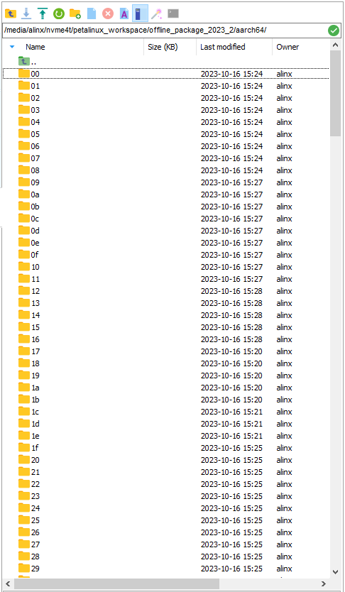
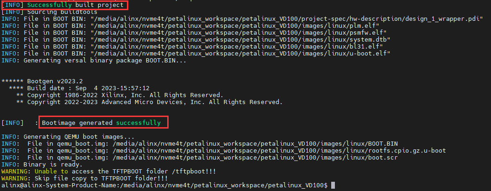
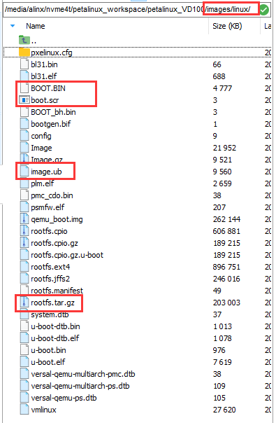

## 关于PETALINUX
---
### 前言
- petalinux工程通常会和vivado工程有很强的关联，我们在[petalinux](../../petalinux)路径中提供的petalinux工程也是针对我们提供的[vivado](../../vivado)工程添加了很多配置的。我们提供的vivado工程以及petalinux涵盖了VD100开发板的大部分接口，如果您是第一次在VD100上使用Linux，建议您先体验我们提供的petalinux工程。
- 使用我们提供的工程和例程，**请务必使用2023.2版本的XILINX开发套件**，包括Vivado、[Petalinux](https://www.xilinx.com/member/forms/download/xef.html?filename=petalinux-v2023.2-10121855-installer.run)以及其他。
- 关于**离线编译**：Petalinux工程编译时会从网上获取大量的必要资源，编译速度也依赖于网速，如果网络不稳定还有可能在等待很久之后编译失败，因此**推荐使用离线编译**。首先从 AMD|XILINX 官网下载离线编译所需要的离线资源包[aarch64 sstate-cache](https://www.xilinx.com/member/forms/download/xef.html?filename=sstate_aarch64_2023.2_10121051.tar.gz)、[Downloads](https://www.xilinx.com/member/forms/download/xef.html?filename=downloads_2023.2_10121051.tar.gz)到Ubuntu系统的文件夹中并解压（解压完成后可以删除压缩包）。如下图：\
  \
记录这两个包的路径(**这里记录的是我的路径，请根据你实际存放的路径做记录**)：\
*/media/alinx/nvme4t/petalinux_workspace/offline_package_2023_2/aarch64* \
***file://**/media/alinx/nvme4t/petalinux_workspace/offline_package_2023_2/downloads* \
注意，downloads包的路径前需要加上 **file://** 前缀。后面再介绍如何使用这两个路径来设置petalinux工程的离线编译。

---
### 使用本路径中的PETALINUX工程文件夹
1. 把[petalinux](../../petalinux)路径中的所有文件拷贝到Ubuntu系统的文件夹中，如下图(注意 *.petalinux*文件夹再Ubuntu中默认是隐藏的)：\

2. 在这个路径中打开终端，设置petalinux的环境变量。\
如果你的Petalinux工具和我一样安装在 *~/Xilinx/petalinux/2023.2* 路径中，则使用下面命令来设置环境变量：\
`source ~/Xilinx/petalinux/2023.2/settings.sh` \

3. 接下来使用之前记录的离线包来设置离线编译(如果你不需使用离线编译，则可以跳过这一步)。运行这条命令来设置离线编译: \
`chmod +x ./set_offline_sstate_and_downloads.sh && ./set_offline_sstate_and_downloads.sh` \
输入1设置离线编译，输入2恢复成在线编译，输入其他任意值退出脚本：\

这里我选择 **1**，然后先输入**aarch64 sstate-cache**包的路径然后按回车，
再输入**downloads**资源包的路径。按回车等待提示 **[INFO] Successfully configured project** 以及 **offline package set over** 后就设置完成了：\

5. 现在就可以编译petalinux工程了，在终端中输入下面的命令编译工程并在编译完成后打包BOOT.bin：\
`petalinux-build && petalinux-package --boot --u-boot --force`\
即使是使用离线编译，每个工程的第一次编译都会花上较长的时间。等提示了 **** 和 **** 则表示编译成功，并且打包了BOOT.bin：\

6. 查看petalinux工程的 *images/linux* 路径，这里就是编译和打包的文件。我们需要其中的BOOT.bin、image.ub、boot.scr以及rootfs.tar.gz这四个文件在开发板上启动LINUX。\
 \
关于如何使用这四个文件制作在开发板上启动Linux的SD卡请参考: [1_快速启动Linux-制作启动开发板linux系统的SD卡.md](./1_快速启动Linux-制作启动开发板linux系统的SD卡.md)。开发板系统起来之后请参考本路径中 **3_在Linux系统中测试开发板外设** 系列文档使用外设。

---
### 通常的PETALINUX使用流程
实际上使用我们提供的Petalinux工程制作板卡系统与通常的Petalinux使用步骤会有所差别。

一般步骤如下:
- STEP1:创建versal模板的名为petalinux的petalinux工程：\
`petalinux-create -t project --template versal -n petalinux` 
- STEP2:进入petalinux工程路径并配置硬件描述文件，假设我把硬件描述文件 **.xsa* 放在petalinux工程的同级路径 *hardware* 文件夹中:  \
`cd ./petalinux && petalinux-config --get-hw-description ../hardware` 
- STEP3:如果没有其他需要设置，就可以编译工程了，编译完成后打包*BOOT.bin* \
`petalinux-build && petalinux-package --boot --u-boot --force` 

更加详细的流程请参考 AMD|XILINX 官方文档[UG1144(v2023.2)](https://docs.xilinx.com/r/en-US/ug1144-petalinux-tools-reference-guide)。

---
---
- 访问[ALINX官方网站](https://www.alinx.com)以获取更多信息。
