ALINX Versal AI Edge

系列的自适应计算加速平台(ACAP)（型号：VD100）正式发布了，为了让您对此开发平台可以快速了解，我们编写了此用户手册。

这款Versal AI
Edge开发平台采用核心板加扩展板的模式，方便用户对核心板的二次开发利用。在底板设计上我们采用了1路12pin的PMOD接口，2路万兆光纤接口，2路以太网口，2路MIPI接口，1路USB2.0接口，1路UART接口和1路PCIe3.0X4接口。满足用户的高速数据传输和交换的要求，是一款数据通信的“专业级”和"全能级“开发平台。相信这样的一款产品非常适合从事人工智能，数据加速和视频图像处理的学生、工程师等群体。

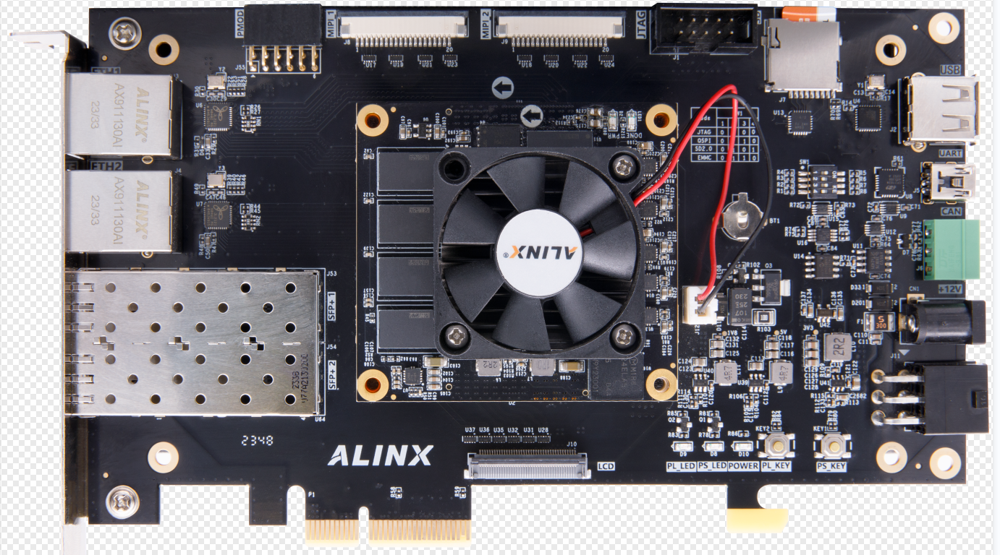

开发板简介
==========

在这里，对这款Versal AI VD100平台进行简单的功能介绍。

开发板的整个结构，继承了我们一贯的核心板+扩展板的模式来设计的。核心板和扩展板之间使用高速板间连接器连接。

核心板主要由Versal AI VE2302 + 4个DDR4 + QSPI
FLASH+EMMC构成，我们选用的Versal AI
Series的VE2302芯片，SFVA784封装。VE2302和DDR4的数据位宽为64位，DDR4容量高达4GB，数据速率为2400bps。满足数据处理过程中对高缓冲区的需求。另外核心板上有8G的EMMC和512Mbit的QSPI
FLASH，用于系统启动和数据存储。

底板上带有丰富的外围接口，下图为整个VD100平台的结构示意图：

.. image:: images/media/image3.png

通过这个示意图，我们可以看到，我们这个开发平台所能实现的功能。

-   Versal AI VE2302核心板

由VE2302+4GB DDR4+8G EMMC+512Mb QSPI
FLASH组成，另外有两个高精度Sitime公司的晶振，一个是单端33.3333MHz，另一个是差分200MHz，为VE2302系统和逻辑单元提供稳定的时钟输入。

-  10/100M/1000M以太网RJ-45接口

2路千兆以太网接口，芯片采用景略公司的JL2121以太网PHY芯片为用户提供网络通信服务。JL2121
芯片支持10/100/1000 Mbps网络传输速率; 全双工和自适应。

-  USB Uart调试接口

1路Uart转USB接口，用于和电脑通信，方便用户调试。串口芯片采用Silicon Labs
CP2102GM的USB-UAR芯片, USB接口采用MINI USB接口。

-  PCIe x4接口

支持PCI Express 3.0标准，提供标准的PCIe x4高速数据传输接口。

-  Micro SD卡座

1路Micro SD卡座，用于存储操作系统镜像和文件系统。

-  USB2.0接口

..

   1路高速USB2.0接口, 可用于开发板连接鼠标、键盘和U盘等USB外设。

-  MIPI接口

..

   2路MIPI接口，支持MIPI 4xLane, 可以连接ALINX的MIPI摄像头（AN5010）。

-  LVDS接口

1路LVDS接口，用于连接ALINX的LVDS显示屏。

-  2路SFP+光纤接口

GTY收发器的2路高速收发器连接到2个光模块的发送和接收，实现2路高速的光纤通信接口。每路的光纤数据通信接收和发送的速度高达12.5Gb/s。

-  CAN通信接口

1路CAN/CAN
FD总线接口，选用TI公司的TJA1051T芯片，接口采用3Pin的绿色接线端子。

-  12针PMOD扩展口

预留1个12针2.54mm间距的扩展IO口，扩展口包含2路3.3V电源，2路地，8路3.3V
IO口。

-  JTAG口

10针2.54mm标准的JTAG口，用于VE2302程序的下载和调试;

-  按键

扩展板上2个用户按键，一个连接到PS的MIO，一个连接到PL的IO；

-  LED灯

5个LED（2个在核心板，3个在扩展板）；

VE2302核心板
============

简介
----

V100(**核心板型号，下同**)核心板，是基于XILINX公司的Versal
ACAP系列的XCVE2302-SFVA784-1LP-E-S这款芯片开发的高性能核心板，具有高性能，低延迟，边缘计算，低功耗等特点，适合数据中心，视频图像处理，高速数据处理等方面使用。

   这款核心板使用了4片MICRON公司的MT40A512M16LY-062E

这款DDR4芯片，有64位数据总线带宽和4GB的容量；DDR4
SDRAM的最高运行速度可达1200MHz(数据速率2400Mbps)。另外核心板上也集成了2片256MBit大小的QSPI
FLASH和1片8GB大小的EMMC芯片，用于启动存储配置和系统文件。

   这款核心板PS端扩展了53个1.8V电平标准的MIO，PL端扩展了22个3.3V电平标准IO，54个1.8V电平标准IO口，30个1.2V电平标准IO，还有8对GTY高速RX/TX差分信号。而且，FPGA芯片到接口之间走线做了等长和差分处理，并且核心板尺寸仅为65*60（mm），对于二次开发来说，非常适合。

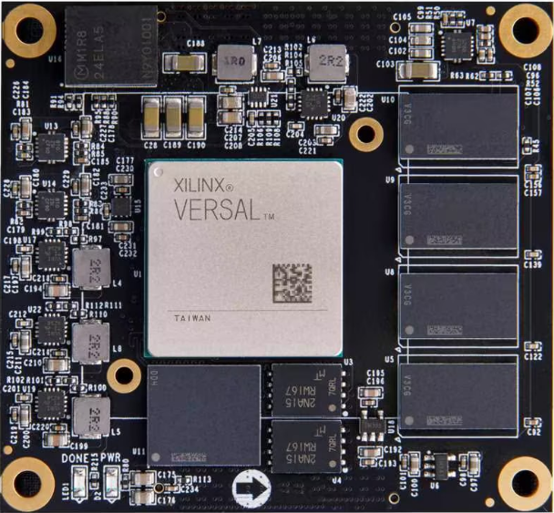

V100核心板正面图

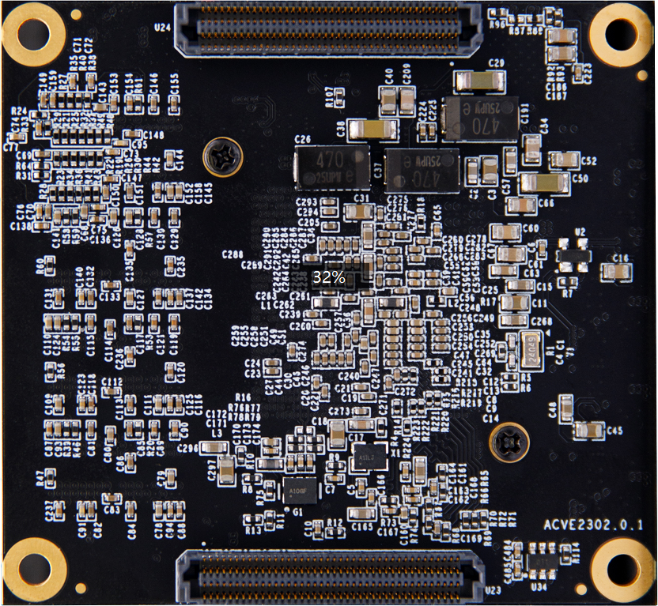

V100核心板背面图

VE2302
------

前面已经介绍过了，我们所使用的Versal
ACAP型号为XCVE2302-SFVA784-1LP-E-S，速度等级为1，工作温度0~100℃，封装为SFVA784。Versal
ACAP的芯片命名规则如下：

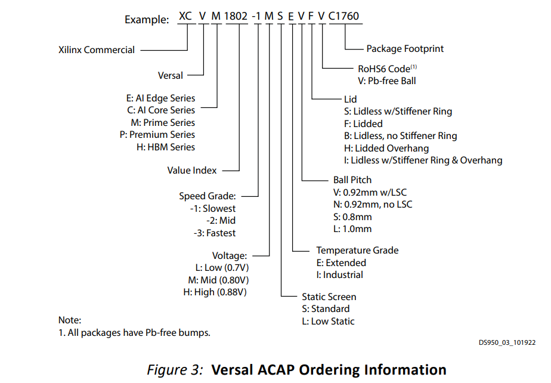

VE2302芯片的集成了4个ARM
Cortex™-A72处理器和2个Cortex-R5F处理器，另外还有34个AI
Engines-ML加速单元和464个DSP处理单元。VE2302的内部资源如下所示：

.. image:: images/media/image7.png
   :width: 6.28958in
   :height: 3.75347in

时钟配置
--------

V100核心板上分别为PS系统,
PL逻辑部分提供了参考时钟和RTC实时时钟，使PS系统和PL逻辑可以单独工作。时钟电路设计的示意图如下图2-3-1所示：

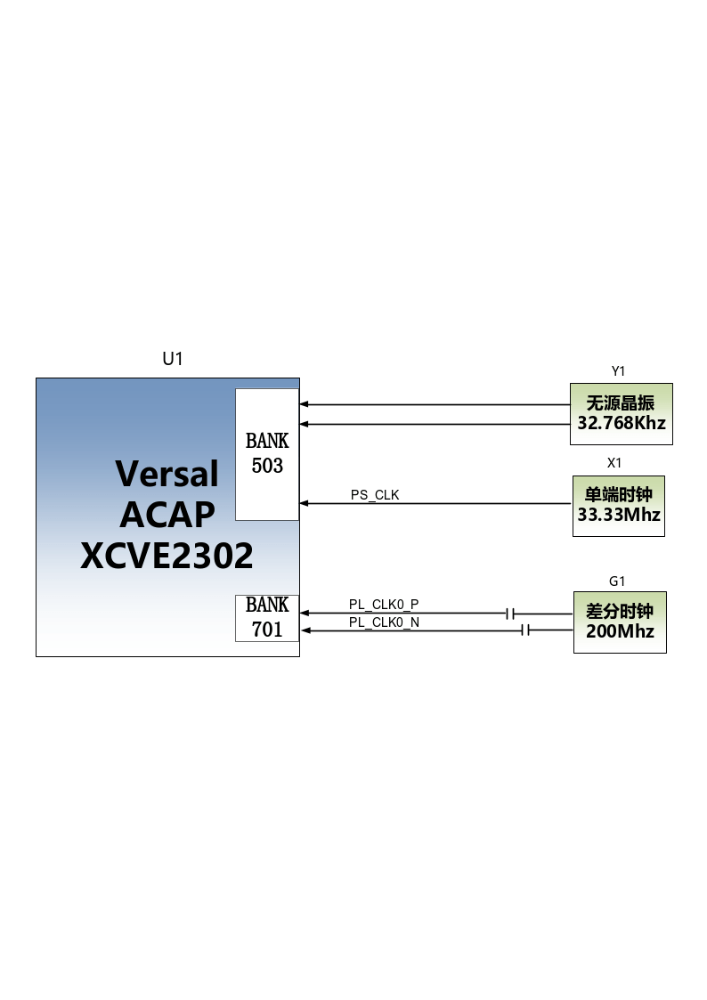

图 2-3-1 核心板时钟源

**PS系统RTC实时时钟**

核心板上的无源晶体Y1为PS系统的提供32.768KHz的实时时钟源。晶体连接到VE2302芯片的BANK503的RTC_PADI_503和RTC_PADO_503的管脚上。

**PS系统时钟源**

核心板上的X1晶振为PS系统提供33.333MHz的时钟输入。时钟的输入连接到VE2302芯片的BANK503的PS_REF_CLK_503的管脚上。

**PL系统时钟源**

板上提供了一个差分200MHz的PL系统时钟源，用于DDR4控制器的参考时钟。晶振输出连接到PL
BANK701的全局时钟(GC)，这个全局时钟可以用来驱动FPGA内的DDR4控制器和用户逻辑电路。

**PL时钟引脚分配：**

+--------------------+----------------------------+--------------------+
| 信号名称           | VE2302管脚名               | VE2302管脚号       |
+--------------------+----------------------------+--------------------+
| PL_CLK0_N          | IO_L                       | AC23               |
|                    | 24N_GC_XCC_N8P1_M0P103_701 |                    |
+--------------------+----------------------------+--------------------+
| PL_CLK0_P          | IO_L                       | AB23               |
|                    | 24P_GC_XCC_N8P0_M0P102_701 |                    |
+--------------------+----------------------------+--------------------+

DDR4 DRAM
---------

V100核心板上配有4片Micron(美光）的1GB的DDR4芯片,型号为MT40A512M16LY-062E,
4片DDR4挂在BANK700，701和702的XPIO上，组成64位数据总线带宽和4GB的容量。DDR4
SDRAM的最高运行速度可达1200MHz(数据速率2400Mbps)。DDR4
SDRAM的具体配置如下表2-4-1所示。

+----------------+---------------------+----------------+-------------+
| **位号**       | **芯片型号**        | **容量**       | **厂家**    |
+----------------+---------------------+----------------+-------------+
| U5,U8,U9,U10   | MT40A512M16LY-062E  | 512M x 16bit   | Micron      |
+----------------+---------------------+----------------+-------------+

表2-4-1 DDR4 SDRAM配置

DDR4的硬件设计需要严格考虑信号完整性，我们在电路设计和PCB设计的时候已经充分考虑了匹配电阻/终端电阻,走线阻抗控制，走线等长控制，保证DDR4的高速稳定的工作。DDR4的硬件连接方式如图2-4-1所示:

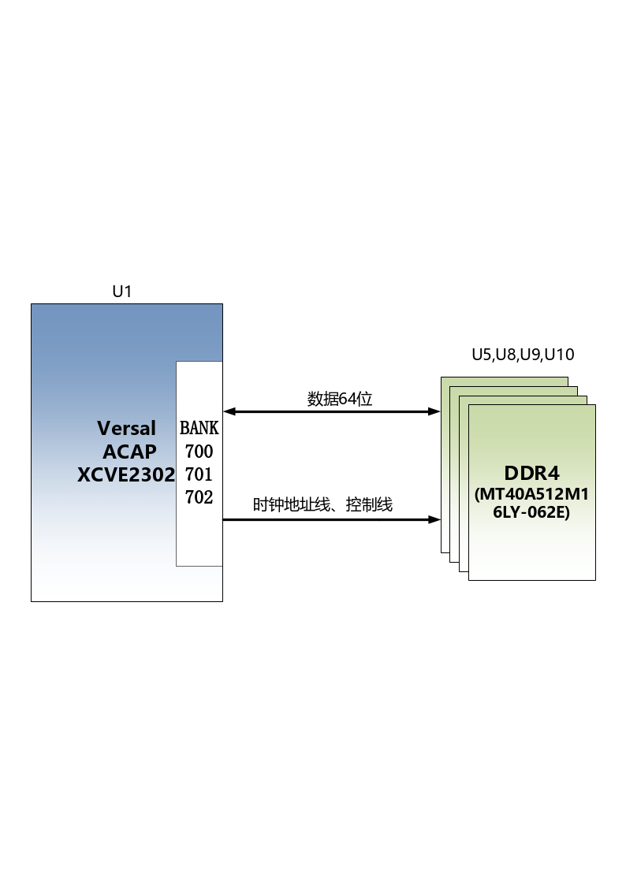

图2-4-1 DDR4 DRAM原理图部分

**DDR4 SDRAM引脚分配：**

+--------------------+--------------------------------+---------------+
| **信号名称**       | **引脚名**                     | **引脚号**    |
+--------------------+--------------------------------+---------------+
| PL_DDR4_A0         | IO_L18P_XCC_N6P0_M0P36_700     | AB12          |
+--------------------+--------------------------------+---------------+
| PL_DDR4_A1         | IO_L17N_N5P5_M0P35_700         | AE22          |
+--------------------+--------------------------------+---------------+
| PL_DDR4_A2         | IO_L17P_N5P4_M0P34_700         | AD22          |
+--------------------+--------------------------------+---------------+
| PL_DDR4_A3         | IO_L20P_N6P4_M0P40_700         | AB15          |
+--------------------+--------------------------------+---------------+
| PL_DDR4_A4         | IO_L12P_GC_XCC_N4P0_M0P24_700  | AD12          |
+--------------------+--------------------------------+---------------+
| PL_DDR4_A5         | IO_L26P_N8P4_M0P52_700         | AE17          |
+--------------------+--------------------------------+---------------+
| PL_DDR4_A6         | IO_L24P_GC_XCC_N8P0_M0P48_700  | AD16          |
+--------------------+--------------------------------+---------------+
| PL_DDR4_A7         | IO_L6N_GC_XCC_N2P1_M0P13_700   | AG11          |
+--------------------+--------------------------------+---------------+
| PL_DDR4_A8         | IO_L25N_N8P3_M0P51_700         | AE14          |
+--------------------+--------------------------------+---------------+
| PL_DDR4_A9         | IO_L19P_N6P2_M0P38_700         | AB14          |
+--------------------+--------------------------------+---------------+
| PL_DDR4_A10        | IO_L21N_XCC_N7P1_M0P43_700     | AB17          |
+--------------------+--------------------------------+---------------+
| PL_DDR4_A11        | IO_L25P_N8P2_M0P50_700         | AE13          |
+--------------------+--------------------------------+---------------+
| PL_DDR4_A12        | IO_L0N_XCC_N0P1_M0P1_700       | AH12          |
+--------------------+--------------------------------+---------------+
| PL_DDR4_A13        | IO_L24N_GC_XCC_N8P1_M0P49_700  | AD15          |
+--------------------+--------------------------------+---------------+
| PL_DDR4_CLK_N      | IO_L15N_XCC_N5P1_M0P31_700     | AD19          |
+--------------------+--------------------------------+---------------+
| PL_DDR4_CLK_P      | IO_L15P_XCC_N5P0_M0P30_700     | AC19          |
+--------------------+--------------------------------+---------------+
| PL_DDR4_BA0        | IO_L20N_N6P5_M0P41_700         | AC16          |
+--------------------+--------------------------------+---------------+
| PL_DDR4_BA1        | IO_L12N_GC_XCC_N4P1_M0P25_700  | AD11          |
+--------------------+--------------------------------+---------------+
| PL_DDR4_WE_B       | IO_L16N_N5P3_M0P33_700         | AD21          |
+--------------------+--------------------------------+---------------+
| PL_DDR4_CAS_B      | IO_L14N_N4P5_M0P29_700         | AD17          |
+--------------------+--------------------------------+---------------+
| PL_DDR4_CS_B       | IO_L14P_N4P4_M0P28_700         | AC17          |
+--------------------+--------------------------------+---------------+
| PL_DDR4_ACT_B      | IO_L18N_XCC_N6P1_M0P37_700     | AC11          |
+--------------------+--------------------------------+---------------+
| PL_DDR4_RAS_B      | IO_L19N_N6P3_M0P39_700         | AC13          |
+--------------------+--------------------------------+---------------+
| PL_DDR4_BG0        | IO_L21P_XCC_N7P0_M0P42_700     | AB18          |
+--------------------+--------------------------------+---------------+
| PL_DDR4_ODT        | IO_L23N_N7P5_M0P47_700         | AC22          |
+--------------------+--------------------------------+---------------+
| PL_DDR4_CKE        | IO_L23P_N7P4_M0P46_700         | AB21          |
+--------------------+--------------------------------+---------------+
| PL_DDR4_RST        | IO_L25P_N8P2_M0P104_701        | AC24          |
+--------------------+--------------------------------+---------------+
| PL_DDR4_DQS0_N     | IO_L9N_GC_XCC_N3P1_M0P19_700   | AG16          |
+--------------------+--------------------------------+---------------+
| PL_DDR4_DQS0_P     | IO_L9P_GC_XCC_N3P0_M0P18_700   | AG17          |
+--------------------+--------------------------------+---------------+
| PL_DDR4_DQS1_N     | IO_L3N_XCC_N1P1_M0P7_700       | AH19          |
+--------------------+--------------------------------+---------------+
| PL_DDR4_DQS1_P     | IO_L3P_XCC_N1P0_M0P6_700       | AG20          |
+--------------------+--------------------------------+---------------+
| PL_DDR4_DQS2_N     | IO_L6N_GC_XCC_N2P1_M0P67_701   | AD27          |
+--------------------+--------------------------------+---------------+
| PL_DDR4_DQS2_P     | IO_L6P_GC_XCC_N2P0_M0P66_701   | AC28          |
+--------------------+--------------------------------+---------------+
| PL_DDR4_DQS3_N     | IO_L3N_XCC_N1P1_M0P61_701      | AF23          |
+--------------------+--------------------------------+---------------+
| PL_DDR4_DQS3_P     | IO_L3P_XCC_N1P0_M0P60_701      | AF24          |
+--------------------+--------------------------------+---------------+
| PL_DDR4_DQS4_N     | IO_L15N_XCC_N5P1_M0P85_701     | AA23          |
+--------------------+--------------------------------+---------------+
| PL_DDR4_DQS4_P     | IO_L15P_XCC_N5P0_M0P84_701     | Y24           |
+--------------------+--------------------------------+---------------+
| PL_DDR4_DQS5_N     | IO_L21N_XCC_N7P1_M0P97_701     | Y27           |
+--------------------+--------------------------------+---------------+
| PL_DDR4_DQS5_P     | IO_L21P_XCC_N7P0_M0P96_701     | Y28           |
+--------------------+--------------------------------+---------------+
| PL_DDR4_DQS6_N     | IO_L0N_XCC_N0P1_M0P109_702     | U28           |
+--------------------+--------------------------------+---------------+
| PL_DDR4_DQS6_P     | IO_L0P_XCC_N0P0_M0P108_702     | U27           |
+--------------------+--------------------------------+---------------+
| PL_DDR4_DQS7_N     | IO_L9N_GC_XCC_N3P1_M0P127_702  | N27           |
+--------------------+--------------------------------+---------------+
| PL_DDR4_DQS7_P     | IO_L9P_GC_XCC_N3P0_M0P126_702  | P26           |
+--------------------+--------------------------------+---------------+
| PL_DDR4_DM0        | IO_L6P_GC_XCC_N2P0_M0P12_700   | AG12          |
+--------------------+--------------------------------+---------------+
| PL_DDR4_DM1        | IO_L0P_XCC_N0P0_M0P0_700       | AH13          |
+--------------------+--------------------------------+---------------+
| PL_DDR4_DM2        | IO_L9P_GC_XCC_N3P0_M0P72_701   | AE28          |
+--------------------+--------------------------------+---------------+
| PL_DDR4_DM3        | IO_L0P_XCC_N0P0_M0P54_701      | AD24          |
+--------------------+--------------------------------+---------------+
| PL_DDR4_DM4        | IO_L12P_GC_XCC_N4P0_M0P78_701  | V22           |
+--------------------+--------------------------------+---------------+
| PL_DDR4_DM5        | IO_L18P_XCC_N6P0_M0P90_701     | V28           |
+--------------------+--------------------------------+---------------+
| PL_DDR4_DM6        | IO_L3P_XCC_N1P0_M0P114_702     | N28           |
+--------------------+--------------------------------+---------------+
| PL_DDR4_DM7        | IO_L6P_GC_XCC_N2P0_M0P120_702  | U25           |
+--------------------+--------------------------------+---------------+
| PL_DDR4_DQ0        | IO_L8P_N2P4_M0P16_700          | AF14          |
+--------------------+--------------------------------+---------------+
| PL_DDR4_DQ1        | IO_L10N_N3P3_M0P21_700         | AG18          |
+--------------------+--------------------------------+---------------+
| PL_DDR4_DQ2        | IO_L8N_N2P5_M0P17_700          | AG15          |
+--------------------+--------------------------------+---------------+
| PL_DDR4_DQ3        | IO_L10P_N3P2_M0P20_700         | AF18          |
+--------------------+--------------------------------+---------------+
| PL_DDR4_DQ4        | IO_L7P_N2P2_M0P14_700          | AF13          |
+--------------------+--------------------------------+---------------+
| PL_DDR4_DQ5        | IO_L11N_N3P5_M0P23_700         | AF19          |
+--------------------+--------------------------------+---------------+
| PL_DDR4_DQ6        | IO_L7N_N2P3_M0P15_700          | AG13          |
+--------------------+--------------------------------+---------------+
| PL_DDR4_DQ7        | IO_L11P_N3P4_M0P22_700         | AE19          |
+--------------------+--------------------------------+---------------+
| PL_DDR4_DQ8        | IO_L2P_N0P4_M0P4_700           | AH17          |
+--------------------+--------------------------------+---------------+
| PL_DDR4_DQ9        | IO_L4P_N1P2_M0P8_700           | AG21          |
+--------------------+--------------------------------+---------------+
| PL_DDR4_DQ10       | IO_L2N_N0P5_M0P5_700           | AH18          |
+--------------------+--------------------------------+---------------+
| PL_DDR4_DQ11       | IO_L4N_N1P3_M0P9_700           | AH20          |
+--------------------+--------------------------------+---------------+
| PL_DDR4_DQ12       | IO_L1P_N0P2_M0P2_700           | AH14          |
+--------------------+--------------------------------+---------------+
| PL_DDR4_DQ13       | IO_L5N_N1P5_M0P11_700          | AH22          |
+--------------------+--------------------------------+---------------+
| PL_DDR4_DQ14       | IO_L1N_N0P3_M0P3_700           | AH15          |
+--------------------+--------------------------------+---------------+
| PL_DDR4_DQ15       | IO_L5P_N1P4_M0P10_700          | AG22          |
+--------------------+--------------------------------+---------------+
| PL_DDR4_DQ16       | IO_L8N_N2P5_M0P71_701          | AF26          |
+--------------------+--------------------------------+---------------+
| PL_DDR4_DQ17       | IO_L7N_N2P3_M0P69_701          | AE26          |
+--------------------+--------------------------------+---------------+
| PL_DDR4_DQ18       | IO_L10N_N3P3_M0P75_701         | AH27          |
+--------------------+--------------------------------+---------------+
| PL_DDR4_DQ19       | IO_L8P_N2P4_M0P70_701          | AE27          |
+--------------------+--------------------------------+---------------+
| PL_DDR4_DQ20       | IO_L11N_N3P5_M0P77_701         | AG27          |
+--------------------+--------------------------------+---------------+
| PL_DDR4_DQ21       | IO_L7P_N2P2_M0P68_701          | AD26          |
+--------------------+--------------------------------+---------------+
| PL_DDR4_DQ22       | IO_L11P_N3P4_M0P76_701         | AG26          |
+--------------------+--------------------------------+---------------+
| PL_DDR4_DQ23       | IO_L10P_N3P2_M0P74_701         | AG28          |
+--------------------+--------------------------------+---------------+
| PL_DDR4_DQ24       | IO_L1N_N0P3_M0P57_701          | AE24          |
+--------------------+--------------------------------+---------------+
| PL_DDR4_DQ25       | IO_L1P_N0P2_M0P56_701          | AD25          |
+--------------------+--------------------------------+---------------+
| PL_DDR4_DQ26       | IO_L5P_N1P4_M0P64_701          | AH24          |
+--------------------+--------------------------------+---------------+
| PL_DDR4_DQ27       | IO_L2P_N0P4_M0P58_701          | AF25          |
+--------------------+--------------------------------+---------------+
| PL_DDR4_DQ28       | IO_L4P_N1P2_M0P62_701          | AG23          |
+--------------------+--------------------------------+---------------+
| PL_DDR4_DQ29       | IO_L2N_N0P5_M0P59_701          | AG25          |
+--------------------+--------------------------------+---------------+
| PL_DDR4_DQ30       | IO_L4N_N1P3_M0P63_701          | AH23          |
+--------------------+--------------------------------+---------------+
| PL_DDR4_DQ31       | IO_L5N_N1P5_M0P65_701          | AH25          |
+--------------------+--------------------------------+---------------+
| PL_DDR4_DQ32       | IO_L17P_N5P4_M0P88_701         | Y22           |
+--------------------+--------------------------------+---------------+
| PL_DDR4_DQ33       | IO_L13P_N4P2_M0P80_701         | V23           |
+--------------------+--------------------------------+---------------+
| PL_DDR4_DQ34       | IO_L16P_N5P2_M0P86_701         | Y23           |
+--------------------+--------------------------------+---------------+
| PL_DDR4_DQ35       | IO_L13N_N4P3_M0P81_701         | W24           |
+--------------------+--------------------------------+---------------+
| PL_DDR4_DQ36       | IO_L16N_N5P3_M0P87_701         | AA22          |
+--------------------+--------------------------------+---------------+
| PL_DDR4_DQ37       | IO_L14P_N4P4_M0P82_701         | V24           |
+--------------------+--------------------------------+---------------+
| PL_DDR4_DQ38       | IO_L17N_N5P5_M0P89_701         | AA21          |
+--------------------+--------------------------------+---------------+
| PL_DDR4_DQ39       | IO_L14N_N4P5_M0P83_701         | W25           |
+--------------------+--------------------------------+---------------+
| PL_DDR4_DQ40       | IO_L19P_N6P2_M0P92_701         | V25           |
+--------------------+--------------------------------+---------------+
| PL_DDR4_DQ41       | IO_L20P_N6P4_M0P94_701         | W27           |
+--------------------+--------------------------------+---------------+
| PL_DDR4_DQ42       | IO_L22P_N7P2_M0P98_701         | AA28          |
+--------------------+--------------------------------+---------------+
| PL_DDR4_DQ43       | IO_L19N_N6P3_M0P93_701         | W26           |
+--------------------+--------------------------------+---------------+
| PL_DDR4_DQ44       | IO_L20N_N6P5_M0P95_701         | Y26           |
+--------------------+--------------------------------+---------------+
| PL_DDR4_DQ45       | IO_L23P_N7P4_M0P100_701        | AA26          |
+--------------------+--------------------------------+---------------+
| PL_DDR4_DQ46       | IO_L22N_N7P3_M0P99_701         | AB28          |
+--------------------+--------------------------------+---------------+
| PL_DDR4_DQ47       | IO_L23N_N7P5_M0P101_701        | AB26          |
+--------------------+--------------------------------+---------------+
| PL_DDR4_DQ48       | IO_L2P_N0P4_M0P112_702         | P27           |
+--------------------+--------------------------------+---------------+
| PL_DDR4_DQ49       | IO_L5P_N1P4_M0P118_702         | K27           |
+--------------------+--------------------------------+---------------+
| PL_DDR4_DQ50       | IO_L2N_N0P5_M0P113_702         | R28           |
+--------------------+--------------------------------+---------------+
| PL_DDR4_DQ51       | IO_L4N_N1P3_M0P117_702         | L28           |
+--------------------+--------------------------------+---------------+
| PL_DDR4_DQ52       | IO_L1P_N0P2_M0P110_702         | R27           |
+--------------------+--------------------------------+---------------+
| PL_DDR4_DQ53       | IO_L5N_N1P5_M0P119_702         | K28           |
+--------------------+--------------------------------+---------------+
| PL_DDR4_DQ54       | IO_L1N_N0P3_M0P111_702         | T28           |
+--------------------+--------------------------------+---------------+
| PL_DDR4_DQ55       | IO_L4P_N1P2_M0P116_702         | M27           |
+--------------------+--------------------------------+---------------+
| PL_DDR4_DQ56       | IO_L8P_N2P4_M0P124_702         | P25           |
+--------------------+--------------------------------+---------------+
| PL_DDR4_DQ57       | IO_L10N_N3P3_M0P129_702        | L26           |
+--------------------+--------------------------------+---------------+
| PL_DDR4_DQ58       | IO_L8N_N2P5_M0P125_702         | R26           |
+--------------------+--------------------------------+---------------+
| PL_DDR4_DQ59       | IO_L10P_N3P2_M0P128_702        | M26           |
+--------------------+--------------------------------+---------------+
| PL_DDR4_DQ60       | IO_L7P_N2P2_M0P122_702         | T25           |
+--------------------+--------------------------------+---------------+
| PL_DDR4_DQ61       | IO_L11N_N3P5_M0P131_702        | K26           |
+--------------------+--------------------------------+---------------+
| PL_DDR4_DQ62       | IO_L7N_N2P3_M0P123_702         | T26           |
+--------------------+--------------------------------+---------------+
| PL_DDR4_DQ63       | IO_L11P_N3P4_M0P130_702        | J25           |
+--------------------+--------------------------------+---------------+

QSPI Flash
----------

核心板上使用了2片256Mbit大小的QSPI
FLASH芯片，型号为MT25QU256ABA1EW9-0SIT ，它使用1.8V
CMOS电压标准。由于它的非易失特性，在使用中，QSPI
FLASH可以作为FPGA系统的启动镜像。这些镜像主要包括FPGA的bit文件、软核的应用程序代码以及其它的用户数据文件。

QSPI FLASH的具体型号和相关参数见下表

+----------+--------------------------+-----------------+-------------+
| **位号** | **芯片类型**             | **容量**        | **厂家**    |
+----------+--------------------------+-----------------+-------------+
| U3，U4   | MT25QU256ABA1EW9-0SIT    | 256M Bit        | Micron      |
+----------+--------------------------+-----------------+-------------+

..

   表2-5-1 QSPI Flash的型号和参数

QSPI FLASH连接到Versal
ACAP芯片的PS部分BANK500的XPIO口上，在系统设计中需要配置这些PS端的MIO口功能为QSPI
FLASH接口。\ |image1|

图2-5-1 QSPI Flash连接示意图

**配置芯片引脚分配：**

+----------------------+----------------------------+-----------------+
| **信号名称**         | **引脚名**                 | **引脚号**      |
+----------------------+----------------------------+-----------------+
| MIO0_QSPI0_SCLK      | PMC_MIO0_500               | AA1             |
+----------------------+----------------------------+-----------------+
| MIO1_QSPI0_IO1       | PMC_MIO1_500               | AB1             |
+----------------------+----------------------------+-----------------+
| MIO2_QSPI0_IO2       | PMC_MIO2_500               | AD1             |
+----------------------+----------------------------+-----------------+
| MIO3_QSPI0_IO3       | PMC_MIO3_500               | AE1             |
+----------------------+----------------------------+-----------------+
| MIO4_QSPI0_IO0       | PMC_MIO4_500               | AF1             |
+----------------------+----------------------------+-----------------+
| MIO5_QSPI0_SS_B      | PMC_MIO5_500               | AG1             |
+----------------------+----------------------------+-----------------+
| MIO7_QSPI1_SS_B      | PMC_MIO7_500               | AG2             |
+----------------------+----------------------------+-----------------+
| MIO8_QSPI1_IO0       | PMC_MIO8_500               | AE2             |
+----------------------+----------------------------+-----------------+
| MIO9_QSPI1_IO1       | PMC_MIO9_500               | AD2             |
+----------------------+----------------------------+-----------------+
| MIO10_QSPI1_IO2      | PMC_MIO10_500              | AC2             |
+----------------------+----------------------------+-----------------+
| MIO11_QSPI1_IO3      | PMC_MIO11_500              | AB2             |
+----------------------+----------------------------+-----------------+
| MIO12_QSPI1_SCLK     | PMC_MIO12_500              | AA3             |
+----------------------+----------------------------+-----------------+

eMMC Flash
----------

V100核心板配有一片大容量的8GB大小的eMMC
FLASH芯片，型号为MTFC8GAKAJCN-4M，它支持JEDEC e-MMC
V5.0标准的HS-MMC接口，电平支持1.8V或者3.3V。eMMC
FLASH和ACAP连接的数据宽度为8bit。由于eMMC
FLASH的大容量和非易失特性，在ACAP系统使用中，它可以作为系统大容量的存储设备，比如存储ARM的应用程序、系统文件以及其它的用户数据文件。eMMC
FLASH的具体型号和相关参数见表2-6-1。

+--------------+--------------------+------------------+--------------+
| **位号**     | **芯片类型**       | **容量**         | **厂家**     |
+--------------+--------------------+------------------+--------------+
| U8           | MTFC8GAKAJCN-4M    | 8G Byte          | Micron       |
+--------------+--------------------+------------------+--------------+

表2-6-1 eMMC Flash的型号和参数

eMMC FLASH连接到Versal ACAP的PS部分BANK501的PMC
MIO口上，在系统设计中需要配置这些PMC
MIO口功能为EMMC接口。为图2-6-1为eMMC Flash在原理图中的部分。

.. image:: images/media/image11.png

图2-6-1 eMMC Flash连接示意图

**配置芯片引脚分配：**

+--------------------------+-------------------------+-----------------+
| **信号名称**             | **引脚名**              | **引脚号**      |
+--------------------------+-------------------------+-----------------+
| MMC_CCLK                 | PMC_MIO38_501           | AE8             |
+--------------------------+-------------------------+-----------------+
| MMC_CMD                  | PMC_MIO40_501           | AB8             |
+--------------------------+-------------------------+-----------------+
| MMC_DAT0                 | PMC_MIO41_501           | AA8             |
+--------------------------+-------------------------+-----------------+
| MMC_DAT1                 | PMC_MIO42_501           | AA9             |
+--------------------------+-------------------------+-----------------+
| MMC_DAT2                 | PMC_MIO43_501           | AC9             |
+--------------------------+-------------------------+-----------------+
| MMC_DAT3                 | PMC_MIO44_501           | AD9             |
+--------------------------+-------------------------+-----------------+
| MMC_DAT4                 | PMC_MIO45_501           | AE9             |
+--------------------------+-------------------------+-----------------+
| MMC_DAT5                 | PMC_MIO46_501           | AF9             |
+--------------------------+-------------------------+-----------------+
| MMC_DAT6                 | PMC_MIO47_501           | AF10            |
+--------------------------+-------------------------+-----------------+
| MMC_DAT7                 | PMC_MIO48_501           | AD10            |
+--------------------------+-------------------------+-----------------+
| MMC_RSTN                 | PMC_MIO49_501           | AC10            |
+--------------------------+-------------------------+-----------------+

LED灯
------

V100核心板上有1个红色电源指示灯(PWR)，1个是配置LED灯(DONE)。当核心板供电后，电源指示灯会亮起；当FPGA
配置程序后，配置LED灯会亮起。LED灯硬件连接的示意图如图2-7-1所示：

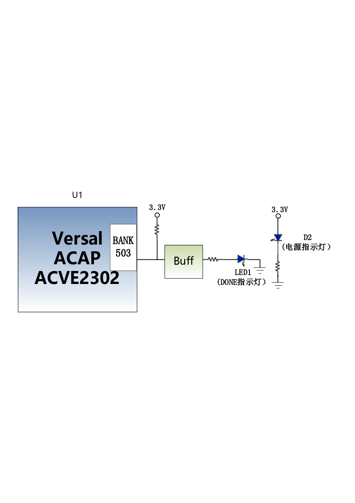

图2-7-1 开发板LED灯硬件连接示意图

电源
----

V100核心板供电电压为7.5V~15V(典型值12V），通过连接底板给核心板供电。核心板上通过MYMGM1R824ELA5RA
电源芯片为XCVE2302提供核心电源0.7V,
另外BANK503，BANK700，BANK302的电源用DCDC芯片TLV62130RGT产生。BANK703和GTY收发器的电源由LDO芯片产生。

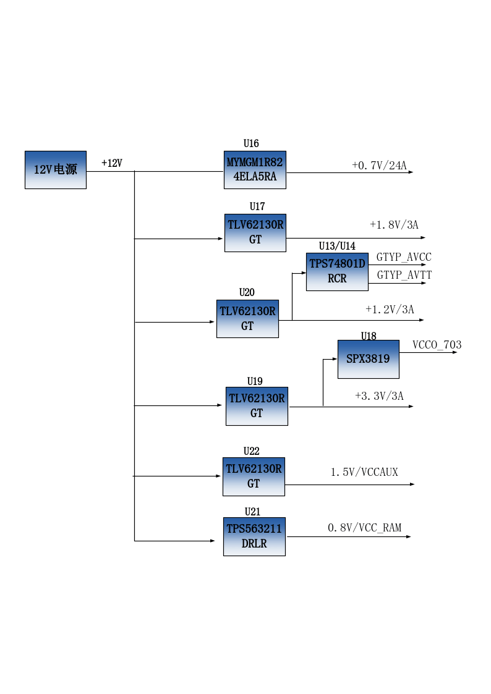

因为Versal ACAP FPGA的电源有上电顺序的要求，在电路设计中，我们已经按照
芯片的电源要求设计上电依次为:

1). VCCIO503(3.3V), VCCO302(3.3V), VCCIO_501/502/503（1.8 V),

VCCIO700/701/702(1.2V)

1. VCCINT/VCC_PMC/VCC_PSFP/VCC_PSLP(0.7V)

2. VCCBRAM/VCC_SOC/VCC_IO (0.8V)

3. VCCAUX/VCCAUX_PMC/VCCAUX_SMON(1.5V)

4. GTYP_AVCC (0.9V)

5. GTYP_AVTT(1.2V)

扩展接口
--------

核心板的背面一共扩展出2个高速扩展口，使用2个160Pin的板间连接器（Samtec:ADF6-40-03.5-L-4-2-A-TR）和底板连接，FPGA的IO口通过差分走线方式连接到这2个扩展口上。连接器的PIN脚间距为0.5mm，和底板的母座连接器配置实现高速数据通信。

**扩展口U23A**

160Pin的连接器U23用来连接底板的VCCIN电源(+12V),地和FPGA的普通IO，这里需要注意，U23的A和B列的是连接到BANK702和PS端的IO口的。U23_AB扩展口的管脚分配如表2-9-1所示：

**2-9-1表：扩展口U23_AB引脚分配**

+------+-------------+------+-----+------+------------+------+-----+
| U23  | 信号        | FPGA | 电  | U23  | 信号       | FPGA | 电  |
| 管脚 |             |      | 平  |      |            |      | 平  |
|      | 名称        | 管   | 标  | 管脚 | 名称       | 管   | 标  |
|      |             | 脚号 | 准  |      |            | 脚号 | 准  |
+------+-------------+------+-----+------+------------+------+-----+
| A1   | B702_L17_N  | J24  | 1   | B1   | B702_L12_N | T24  | 1   |
|      |             |      | .2V |      |            |      | .2V |
+------+-------------+------+-----+------+------------+------+-----+
| A2   | B702_L17_P  | K23  | 1   | B2   | B702_L12_P | U23  | 1   |
|      |             |      | .2V |      |            |      | .2V |
+------+-------------+------+-----+------+------------+------+-----+
| A3   | GND         | -    | 地  | B3   | GND        | -    | 地  |
+------+-------------+------+-----+------+------------+------+-----+
| A4   | B702_L25_N  | L25  | 1   | B4   | B702_L16_N | K24  | 1   |
|      |             |      | .2V |      |            |      | .2V |
+------+-------------+------+-----+------+------------+------+-----+
| A5   | B702_L25_P  | L24  | 1   | B5   | B702_L16_P | L23  | 1   |
|      |             |      | .2V |      |            |      | .2V |
+------+-------------+------+-----+------+------------+------+-----+
| A6   | GND         | -    | 地  | B6   | GND        | -    | 地  |
+------+-------------+------+-----+------+------------+------+-----+
| A7   | B702_L24_N  | N24  | 1   | B7   | B702_L21_N | M21  | 1   |
|      |             |      | .2V |      |            |      | .2V |
+------+-------------+------+-----+------+------------+------+-----+
| A8   | B702_L24_P  | N23  | 1   | B8   | B702_L21_P | N21  | 1   |
|      |             |      | .2V |      |            |      | .2V |
+------+-------------+------+-----+------+------------+------+-----+
| A9   | GND         | -    | 地  | B9   | GND        | -    | 地  |
+------+-------------+------+-----+------+------------+------+-----+
| A10  | B702_L22_N  | L22  | 1   | B10  | B302_L5_N  | C12  | 3   |
|      |             |      | .2V |      |            |      | .3V |
+------+-------------+------+-----+------+------------+------+-----+
| A11  | B702_L22_P  | K21  | 1   | B11  | B302_L5_P  | D11  | 3   |
|      |             |      | .2V |      |            |      | .3V |
+------+-------------+------+-----+------+------------+------+-----+
| A12  | GND         | -    | 地  | B12  | GND        | -    | 地  |
+------+-------------+------+-----+------+------------+------+-----+
| A13  | B302_L2_N   | D14  | 3   | B13  | B302_L0_N  | E14  | 3   |
|      |             |      | .3V |      |            |      | .3V |
+------+-------------+------+-----+------+------------+------+-----+
| A14  | B302_L2_P   | E13  | 3   | B14  | B302_L0_P  | F14  | 3   |
|      |             |      | .3V |      |            |      | .3V |
+------+-------------+------+-----+------+------------+------+-----+
| A15  | GND         | -    | 地  | B15  | GND        | -    | 地  |
+------+-------------+------+-----+------+------------+------+-----+
| A16  | PS_MIO31    | AD6  | 1   | B16  | PS_MIO35   | AC7  | 1   |
|      |             |      | .8V |      |            |      | .8V |
+------+-------------+------+-----+------+------------+------+-----+
| A17  | PS_MIO25    | Y4   | 1   | B17  | PS_MIO37   | AE7  | 1   |
|      |             |      | .8V |      |            |      | .8V |
+------+-------------+------+-----+------+------------+------+-----+
| A18  | GND         | -    | 地  | B18  | GND        | -    | 地  |
+------+-------------+------+-----+------+------------+------+-----+
| A19  | PS_MIO26    | AA5  | 1   | B19  | PS_MIO22   | AD4  | 1   |
|      |             |      | .8V |      |            |      | .8V |
+------+-------------+------+-----+------+------------+------+-----+
| A20  | PS_MIO33    | AA6  | 1   | B20  | PS_MIO19   | AH4  | 1   |
|      |             |      | .8V |      |            |      | .8V |
+------+-------------+------+-----+------+------------+------+-----+
| A21  | GND         | -    | 地  | B21  | GND        | -    | 地  |
+------+-------------+------+-----+------+------------+------+-----+
| A22  | PS_MIO32    | AB6  | 1   | B22  | PS_MIO20   | AF4  | 1   |
|      |             |      | .8V |      |            |      | .8V |
+------+-------------+------+-----+------+------------+------+-----+
| A23  | PS_MIO27    | AB5  | 1   | B23  | PS_MIO28   | AC5  | 1   |
|      |             |      | .8V |      |            |      | .8V |
+------+-------------+------+-----+------+------------+------+-----+
| A24  | GND         | -    | 地  | B24  | GND        | -    | 地  |
+------+-------------+------+-----+------+------------+------+-----+
| A25  | PS_MIO14    | AC3  | 1   | B25  | PS_MIO23   | AC4  | 1   |
|      |             |      | .8V |      |            |      | .8V |
+------+-------------+------+-----+------+------------+------+-----+
| A26  | PS_MIO13    | AB3  | 1   | B26  | PS_MIO24   | AA4  | 1   |
|      |             |      | .8V |      |            |      | .8V |
+------+-------------+------+-----+------+------------+------+-----+
| A27  | GND         | -    | 地  | B27  | GND        | -    | 地  |
+------+-------------+------+-----+------+------------+------+-----+
| A28  | LPD_MIO24   | Y8   | 1   | B28  | LPD_MIO4   | Y2   | 1   |
|      |             |      | .8V |      |            |      | .8V |
+------+-------------+------+-----+------+------------+------+-----+
| A29  | LPD_MIO23   | Y7   | 1   | B29  | LPD_MIO3   | Y1   | 1   |
|      |             |      | .8V |      |            |      | .8V |
+------+-------------+------+-----+------+------------+------+-----+
| A30  | GND         | -    | 地  | B30  | GND        | -    | 地  |
+------+-------------+------+-----+------+------------+------+-----+
| A31  | LPD_MIO5    | W2   | 1   | B31  | LPD_MIO18  | W5   | 1   |
|      |             |      | .8V |      |            |      | .8V |
+------+-------------+------+-----+------+------------+------+-----+
| A32  | LPD_MIO2    | W1   | 1   | B32  | LPD_MIO12  | W4   | 1   |
|      |             |      | .8V |      |            |      | .8V |
+------+-------------+------+-----+------+------------+------+-----+
| A33  | GND         | -    | 地  | B33  | GND        | -    | 地  |
+------+-------------+------+-----+------+------------+------+-----+
| A34  | LPD_MIO7    | U2   | 1   | B34  | LPD_MIO1   | U1   | 1   |
|      |             |      | .8V |      |            |      | .8V |
+------+-------------+------+-----+------+------------+------+-----+
| A35  | LPD_MIO6    | V2   | 1   | B35  | LPD_MIO13  | V4   | 1   |
|      |             |      | .8V |      |            |      | .8V |
+------+-------------+------+-----+------+------------+------+-----+
| A36  | GND         | -    | 地  | B36  | GND        | -    | 地  |
+------+-------------+------+-----+------+------------+------+-----+
| A37  | FPGA_TDI    | AG10 | 1   | B37  | FPGA_TCK   | AH10 | 1   |
|      |             |      | .8V |      |            |      | .8V |
+------+-------------+------+-----+------+------------+------+-----+
| A38  | FPGA_TMS    | AH9  | 1   | B38  | FPGA_TDO   | AF8  | 1   |
|      |             |      | .8V |      |            |      | .8V |
+------+-------------+------+-----+------+------------+------+-----+
| A39  | GND         | -    | 地  | B39  | GND        | -    | 地  |
+------+-------------+------+-----+------+------------+------+-----+
| A40  | +12V        |      | +12V| B40  | +12V       |      | +12V|
+------+-------------+------+-----+------+------------+------+-----+

**扩展口U23_CD**

U23B扩展口的管脚分配如表2-9-2所示：

**2-10-2表：扩展口U23_CD引脚分配**

+------+-------------+-------+------+-----+-------------+------+-----+
| U23  | 信号        | FPGA  | 电平 | U23 | 信号        | FPGA | 电  |
| 管脚 |             |       | 标准 |     |             |      | 平  |
|      | 名称        | 管    |      | 管  | 名称        | 管   | 标  |
|      |             | 脚号  |      | 脚  |             | 脚号 | 准  |
+------+-------------+-------+------+-----+-------------+------+-----+
| C1   | B702_L13_N  | R24   | 1.2V | D1  | B702_L14_N  | P24  | 1   |
|      |             |       |      |     |             |      | .2V |
+------+-------------+-------+------+-----+-------------+------+-----+
| C2   | B702_L13_P  | T23   | 1.2V | D2  | B702_L14_P  | R23  | 1   |
|      |             |       |      |     |             |      | .2V |
+------+-------------+-------+------+-----+-------------+------+-----+
| C3   | GND         | -     | 地   | D3  | GND         | -    | 地  |
+------+-------------+-------+------+-----+-------------+------+-----+
| C4   | B702_L26_N  | M25   | 1.2V | D4  | B702_L18_N  | U22  | 1   |
|      |             |       |      |     |             |      | .2V |
+------+-------------+-------+------+-----+-------------+------+-----+
| C5   | B702_L26_P  | N25   | 1.2V | D5  | B702_L18_P  | V21  | 1   |
|      |             |       |      |     |             |      | .2V |
+------+-------------+-------+------+-----+-------------+------+-----+
| C6   | GND         | -     | 地   | D6  | GND         | -    | 地  |
+------+-------------+-------+------+-----+-------------+------+-----+
| C7   | B702_L23_N  | J22   | 1.2V | D7  | B702_L19_N  | R22  | 1   |
|      |             |       |      |     |             |      | .2V |
+------+-------------+-------+------+-----+-------------+------+-----+
| C8   | B702_L23_P  | J21   | 1.2V | D8  | B702_L19_P  | T21  | 1   |
|      |             |       |      |     |             |      | .2V |
+------+-------------+-------+------+-----+-------------+------+-----+
| C9   | GND         | -     | 地   | D9  | GND         | -    | 地  |
+------+-------------+-------+------+-----+-------------+------+-----+
| C10  | B702_L15_N  | M23   | 1.2V | D10 | B702_L20_N  | P22  | 1   |
|      |             |       |      |     |             |      | .2V |
+------+-------------+-------+------+-----+-------------+------+-----+
| C11  | B702_L15_P  | M22   | 1.2V | D11 | B702_L20_P  | R21  | 1   |
|      |             |       |      |     |             |      | .2V |
+------+-------------+-------+------+-----+-------------+------+-----+
| C12  | GND         | -     | 地   | D12 | GND         | -    | 地  |
+------+-------------+-------+------+-----+-------------+------+-----+
| C13  | B302_L3_N   | D12   | 3.3V | D13 | B302_L4_N   | E11  | 3   |
|      |             |       |      |     |             |      | .3V |
+------+-------------+-------+------+-----+-------------+------+-----+
| C14  | B302_L3_P   | E12   | 3.3V | D14 | B302_L4_P   | F11  | 3   |
|      |             |       |      |     |             |      | .3V |
+------+-------------+-------+------+-----+-------------+------+-----+
| C15  | GND         | -     | 地   | D15 | GND         | -    | 地  |
+------+-------------+-------+------+-----+-------------+------+-----+
| C16  | PS_MIO34    | AB7   | 1.8V | D16 | B302_L6_N   | C10  | 3   |
|      |             |       |      |     |             |      | .3V |
+------+-------------+-------+------+-----+-------------+------+-----+
| C17  | PS_MIO30    | AE6   | 1.8V | D17 | B302_L6_P   | D10  | 3   |
|      |             |       |      |     |             |      | .3V |
+------+-------------+-------+------+-----+-------------+------+-----+
| C18  | GND         | -     | 地   | D18 | GND         | -    | 地  |
+------+-------------+-------+------+-----+-------------+------+-----+
| C19  | PS_MIO29    | AD5   | 1.8V | D19 | PS_MIO15    | AE3  | 1   |
|      |             |       |      |     |             |      | .8V |
+------+-------------+-------+------+-----+-------------+------+-----+
| C20  | PS_MIO18    | AH3   | 1.8V | D20 | PS_MIO21    | AE4  | 1   |
|      |             |       |      |     |             |      | .8V |
+------+-------------+-------+------+-----+-------------+------+-----+
| C21  | GND         | -     | 地   | D21 | GND         | -    | 地  |
+------+-------------+-------+------+-----+-------------+------+-----+
| C22  | PS_MIO17    | AG3   | 1.8V | D22 | PS_MIO51    | AA10 | 1   |
|      |             |       |      |     |             |      | .8V |
+------+-------------+-------+------+-----+-------------+------+-----+
| C23  | PS_MIO16    | AF3   | 1.8V | D23 | PS_MIO50    | AB10 | 1   |
|      |             |       |      |     |             |      | .8V |
+------+-------------+-------+------+-----+-------------+------+-----+
| C24  | GND         | -     | 地   | D24 | GND         | -    | 地  |
+------+-------------+-------+------+-----+-------------+------+-----+
| C25  | LPD_MIO22   | T6    | 1.8V | D25 | PS_MIO36    | AD7  | 1   |
|      |             |       |      |     |             |      | .8V |
+------+-------------+-------+------+-----+-------------+------+-----+
| C26  | LPD_MIO15   | T5    | 1.8V | D26 | LPD_MIO20   | W6   | 1   |
|      |             |       |      |     |             |      | .8V |
+------+-------------+-------+------+-----+-------------+------+-----+
| C27  | GND         | -     | 地   | D27 | GND         | -    | 地  |
+------+-------------+-------+------+-----+-------------+------+-----+
| C28  | LPD_MIO19   | Y6    | 1.8V | D28 | LPD_MIO21   | U6   | 1   |
|      |             |       |      |     |             |      | .8V |
+------+-------------+-------+------+-----+-------------+------+-----+
| C29  | LPD_MIO16   | U5    | 1.8V | D29 | LPD_MIO25   | Y9   | 1   |
|      |             |       |      |     |             |      | .8V |
+------+-------------+-------+------+-----+-------------+------+-----+
| C30  | GND         | -     | 地   | D30 | GND         | -    | 地  |
+------+-------------+-------+------+-----+-------------+------+-----+
| C31  | LPD_MIO11   | Y3    | 1.8V | D31 | LPD_MIO8    | T3   | 1   |
|      |             |       |      |     |             |      | .8V |
+------+-------------+-------+------+-----+-------------+------+-----+
| C32  | LPD_MIO17   | V5    | 1.8V | D32 | LPD_MIO14   | T4   | 1   |
|      |             |       |      |     |             |      | .8V |
+------+-------------+-------+------+-----+-------------+------+-----+
| C33  | GND         | -     | 地   | D33 | GND         | -    | 地  |
+------+-------------+-------+------+-----+-------------+------+-----+
| C34  | LPD_MIO10   | V3    | 1.8V | D34 | LPD_MIO0    | T1   | 1   |
|      |             |       |      |     |             |      | .8V |
+------+-------------+-------+------+-----+-------------+------+-----+
| C35  | VCC_BATT    |       | -    | D35 | LPD_MIO9    | U3   | 1   |
|      |             |       |      |     |             |      | .8V |
+------+-------------+-------+------+-----+-------------+------+-----+
| C36  | GND         | -     | 地   | D36 | GND         | -    | 地  |
+------+-------------+-------+------+-----+-------------+------+-----+
| C37  | PS_MODE0    | AG8   | 3.3V | D37 | PS_MODE2    | AG6  | 3   |
|      |             |       |      |     |             |      | .3V |
+------+-------------+-------+------+-----+-------------+------+-----+
| C38  | PS_MODE1    | AG7   | 3.3V | D38 | PS_MODE3    | AG5  | 3   |
|      |             |       |      |     |             |      | .3V |
+------+-------------+-------+------+-----+-------------+------+-----+
| C39  | GND         | -     | 地   | D39 | GND         | -    | 地  |
+------+-------------+-------+------+-----+-------------+------+-----+
| C40  | +12V        |       | +12V | D40 | +12V        |      | +12V|
+------+-------------+-------+------+-----+-------------+------+-----+

**扩展口U24_AB**

160Pin的连接器U24用来扩展FPGA的BANK302，BANK703的普通IO，以及收发器。U24_AB扩展口的管脚分配如表2-9-3所示：

**2-9-3表：扩展口U24_AB引脚分配**

+------+-------------+-------+-----+------+-------------+------+-----+
| U24  | 信号        | FPGA  | 电  | U24  | 信号        | FPGA | 电  |
| 管脚 |             |       | 平  |      |             |      | 平  |
|      | 名称        | 管    | 标  | 管脚 | 名称        | 管   | 标  |
|      |             | 脚号  | 准  |      |             | 脚号 | 准  |
+------+-------------+-------+-----+------+-------------+------+-----+
| A1   | GND         | -     | 地  | B1   | GND         | -    | 地  |
+------+-------------+-------+-----+------+-------------+------+-----+
| A2   | 104_TX2_N   | C4    | 1   | B2   | 104_TX0_N   | E4   | 1   |
|      |             |       | .2V |      |             |      | .2V |
+------+-------------+-------+-----+------+-------------+------+-----+
| A3   | 104_TX2_P   | C5    | 1   | B3   | 104_TX0_P   | E5   | 1   |
|      |             |       | .2V |      |             |      | .2V |
+------+-------------+-------+-----+------+-------------+------+-----+
| A4   | GND         | -     | 地  | B4   | GND         | -    | 地  |
+------+-------------+-------+-----+------+-------------+------+-----+
| A5   | 104_TX3_N   | B7    | 1   | B5   | 104_TX1_N   | D7   | 1   |
|      |             |       | .2V |      |             |      | .2V |
+------+-------------+-------+-----+------+-------------+------+-----+
| A6   | 104_TX3_P   | B8    | 1   | B6   | 104_TX1_P   | D8   | 1   |
|      |             |       | .2V |      |             |      | .2V |
+------+-------------+-------+-----+------+-------------+------+-----+
| A7   | GND         | -     | 地  | B7   | GND         | -    | 地  |
+------+-------------+-------+-----+------+-------------+------+-----+
| A8   | 104_CLK1_N  | F6    | 1   | B8   | 104_CLK0_N  | H6   | 1   |
|      |             |       | .2V |      |             |      | .2V |
+------+-------------+-------+-----+------+-------------+------+-----+
| A9   | 104_CLK1_P  | F7    | 1   | B9   | 104_CLK0_P  | H7   | 1   |
|      |             |       | .2V |      |             |      | .2V |
+------+-------------+-------+-----+------+-------------+------+-----+
| A10  | GND         | -     | 地  | B10  | GND         | -    | 地  |
+------+-------------+-------+-----+------+-------------+------+-----+
| A11  | 103_TX2_N   | J4    | 1   | B11  | 103_TX3_N   | G4   | 1   |
|      |             |       | .2V |      |             |      | .2V |
+------+-------------+-------+-----+------+-------------+------+-----+
| A12  | 103_TX2_P   | J5    | 1   | B12  | 103_TX3_P   | G5   | 1   |
|      |             |       | .2V |      |             |      | .2V |
+------+-------------+-------+-----+------+-------------+------+-----+
| A13  | GND         | -     | 地  | B13  | GND         | -    | 地  |
+------+-------------+-------+-----+------+-------------+------+-----+
| A14  | 103_TX0_N   | N4    | 1   | B14  | 103_TX1_N   | L4   | 1   |
|      |             |       | .2V |      |             |      | .2V |
+------+-------------+-------+-----+------+-------------+------+-----+
| A15  | 103_TX0_P   | N5    | 1   | B15  | 103_TX1_P   | L5   | 1   |
|      |             |       | .2V |      |             |      | .2V |
+------+-------------+-------+-----+------+-------------+------+-----+
| A16  | GND         | -     | 地  | B16  | GND         | -    | 地  |
+------+-------------+-------+-----+------+-------------+------+-----+
| A17  | GND         | -     | 地  | B17  | GND         | -    | 地  |
+------+-------------+-------+-----+------+-------------+------+-----+
| A18  | B302_L10_N  | A14   | 3   | B18  | B302_L9_N   | A13  | 3   |
|      |             |       | .3V |      |             |      | .3V |
+------+-------------+-------+-----+------+-------------+------+-----+
| A19  | B302_L10_P  | B13   | 3   | B19  | B302_L9_P   | B12  | 3   |
|      |             |       | .3V |      |             |      | .3V |
+------+-------------+-------+-----+------+-------------+------+-----+
| A20  | GND         | -     | 地  | B20  | GND         | -    | 地  |
+------+-------------+-------+-----+------+-------------+------+-----+
| A21  | B302_L1_N   | C13   | 3   | B21  | B703_L20_N  | D21  | 1   |
|      |             |       | .3V |      |             |      | .5V |
+------+-------------+-------+-----+------+-------------+------+-----+
| A22  | B302_L1_P   | C14   | 3   | B22  | B703_L20_P  | D20  | 1   |
|      |             |       | .3V |      |             |      | .5V |
+------+-------------+-------+-----+------+-------------+------+-----+
| A23  | GND         | -     | 地  | B23  | GND         | -    | 地  |
+------+-------------+-------+-----+------+-------------+------+-----+
| A24  | B703_L21_N  | C21   | 1   | B24  | B703_L18_N  | H22  | 1   |
|      |             |       | .5V |      |             |      | .5V |
+------+-------------+-------+-----+------+-------------+------+-----+
| A25  | B703_L21_P  | B20   | 1   | B25  | B703_L18_P  | G21  | 1   |
|      |             |       | .5V |      |             |      | .5V |
+------+-------------+-------+-----+------+-------------+------+-----+
| A26  | GND         | -     | 地  | B26  | GND         | -    | 地  |
+------+-------------+-------+-----+------+-------------+------+-----+
| A27  | B703_L16_N  | B23   | 1   | B27  | B703_L24_N  | F24  | 1   |
|      |             |       | .5V |      |             |      | .5V |
+------+-------------+-------+-----+------+-------------+------+-----+
| A28  | B703_L16_P  | C23   | 1   | B28  | B703_L24_P  | F23  | 1   |
|      |             |       | .5V |      |             |      | .5V |
+------+-------------+-------+-----+------+-------------+------+-----+
| A29  | GND         | -     | 地  | B29  | GND         | -    | 地  |
+------+-------------+-------+-----+------+-------------+------+-----+
| A30  | B703_L8_N   | E26   | 1   | B30  | B703_L26_N  | D26  | 1   |
|      |             |       | .5V |      |             |      | .5V |
+------+-------------+-------+-----+------+-------------+------+-----+
| A31  | B703_L8_P   | F26   | 1   | B31  | B703_L26_P  | D25  | 1   |
|      |             |       | .5V |      |             |      | .5V |
+------+-------------+-------+-----+------+-------------+------+-----+
| A32  | GND         | -     | 地  | B32  | GND         | -    | 地  |
+------+-------------+-------+-----+------+-------------+------+-----+
| A33  | B703_L1_N   | G28   | 1   | B33  | B703_L7_N   | G26  | 1   |
|      |             |       | .5V |      |             |      | .5V |
+------+-------------+-------+-----+------+-------------+------+-----+
| A34  | B703_L1_P   | H27   | 1   | B34  | B703_L7_P   | G25  | 1   |
|      |             |       | .5V |      |             |      | .5V |
+------+-------------+-------+-----+------+-------------+------+-----+
| A35  | GND         | -     | 地  | B35  | GND         | -    | 地  |
+------+-------------+-------+-----+------+-------------+------+-----+
| A36  | B703_L6_N   | J26   | 1   | B36  | B703_L0_N   | H28  | 1   |
|      |             |       | .5V |      |             |      | .5V |
+------+-------------+-------+-----+------+-------------+------+-----+
| A37  | B703_L6_P   | H25   | 1   | B37  | B703_L0_P   | J27  | 1   |
|      |             |       | .5V |      |             |      | .5V |
+------+-------------+-------+-----+------+-------------+------+-----+
| A38  | GND         | -     | 地  | B38  | GND         | -    | 地  |
+------+-------------+-------+-----+------+-------------+------+-----+
| A39  | B703_L5_N   | B28   | 1   | B39  | B703_L12_N  | H24  | 1   |
|      |             |       | .5V |      |             |      | .5V |
+------+-------------+-------+-----+------+-------------+------+-----+
| A40  | B703_L5_P   | C27   | 1   | B40  | B703_L12_P  | H23  | 1   |
|      |             |       | .5V |      |             |      | .5V |
+------+-------------+-------+-----+------+-------------+------+-----+

**扩展口U24_CD**

U24_CD扩展口的管脚分配如表2-9-4所示：

**2-9-4表：扩展口U24_CD引脚分配**

+------+-------------+-------+-----+------+-------------+------+-----+
| U24  | 信号        | FPGA  | 电  | U24  | 信号        | FPGA | 电  |
| 管脚 |             |       | 平  |      |             |      | 平  |
|      | 名称        | 管    | 标  | 管脚 | 名称        | 管   | 标  |
|      |             | 脚号  | 准  |      |             | 脚号 | 准  |
+------+-------------+-------+-----+------+-------------+------+-----+
| C1   | GND         | -     | 地  | D1   | GND         | -    | 地  |
+------+-------------+-------+-----+------+-------------+------+-----+
| C2   | 104_RX1_N   | D1    | 1   | D2   | 104_RX0_N   | F1   | 1   |
|      |             |       | .2V |      |             |      | .2V |
+------+-------------+-------+-----+------+-------------+------+-----+
| C3   | 104_RX1_P   | D2    | 1   | D3   | 104_RX0_P   | F2   | 1   |
|      |             |       | .2V |      |             |      | .2V |
+------+-------------+-------+-----+------+-------------+------+-----+
| C4   | GND         | -     | 地  | D4   | GND         | -    | 地  |
+------+-------------+-------+-----+------+-------------+------+-----+
| C5   | 104_RX3_N   | A4    | 1   | D5   | 104_RX2_N   | B1   | 1   |
|      |             |       | .2V |      |             |      | .2V |
+------+-------------+-------+-----+------+-------------+------+-----+
| C6   | 104_RX3_P   | A5    | 1   | D6   | 104_RX2_P   | B2   | 1   |
|      |             |       | .2V |      |             |      | .2V |
+------+-------------+-------+-----+------+-------------+------+-----+
| C7   | GND         | -     | 地  | D7   | GND         | -    | 地  |
+------+-------------+-------+-----+------+-------------+------+-----+
| C8   | 103_CLK1_N  | K6    | 1   | D8   | 103_CLK0_N  | M6   | 1   |
|      |             |       | .2V |      |             |      | .2V |
+------+-------------+-------+-----+------+-------------+------+-----+
| C9   | 103_CLK1_P  | K7    | 1   | D9   | 103_CLK0_P  | M7   | 1   |
|      |             |       | .2V |      |             |      | .2V |
+------+-------------+-------+-----+------+-------------+------+-----+
| C10  | GND         | -     | 地  | D10  | GND         | -    | 地  |
+------+-------------+-------+-----+------+-------------+------+-----+
| C11  | 103_RX2_N   | K1    | 1   | D11  | 103_RX3_N   | H1   | 1   |
|      |             |       | .2V |      |             |      | .2V |
+------+-------------+-------+-----+------+-------------+------+-----+
| C12  | 103_RX2_P   | K2    | 1   | D12  | 103_RX3_P   | H2   | 1   |
|      |             |       | .2V |      |             |      | .2V |
+------+-------------+-------+-----+------+-------------+------+-----+
| C13  | GND         | -     | 地  | D13  | GND         | -    | 地  |
+------+-------------+-------+-----+------+-------------+------+-----+
| C14  | 103_RX1_N   | M1    | 1   | D14  | 103_RX0_N   | P1   | 1   |
|      |             |       | .2V |      |             |      | .2V |
+------+-------------+-------+-----+------+-------------+------+-----+
| C15  | 103_RX1_P   | M2    | 1   | D15  | 103_RX0_P   | P2   | 1   |
|      |             |       | .2V |      |             |      | .2V |
+------+-------------+-------+-----+------+-------------+------+-----+
| C16  | GND         | -     | 地  | D16  | GND         | -    | 地  |
+------+-------------+-------+-----+------+-------------+------+-----+
| C17  | GND         | -     | 地  | D17  | GND         | -    | 地  |
+------+-------------+-------+-----+------+-------------+------+-----+
| C18  | B302_L8_N   | A11   | 3   | D18  | B302_L7_N   | A10  | 3   |
|      |             |       | .3V |      |             |      | .3V |
+------+-------------+-------+-----+------+-------------+------+-----+
| C19  | B302_L8_P   | B11   | 3   | D19  | B302_L7_P   | B10  | 3   |
|      |             |       | .3V |      |             |      | .3V |
+------+-------------+-------+-----+------+-------------+------+-----+
| C20  | GND         | -     | 地  | D20  | GND         | -    | 地  |
+------+-------------+-------+-----+------+-------------+------+-----+
| C21  | B703_L19_N  | F21   | 1   | D21  | B703_L13_N  | G23  | 1   |
|      |             |       | .5V |      |             |      | .5V |
+------+-------------+-------+-----+------+-------------+------+-----+
| C22  | B703_L19_P  | E20   | 1   | D22  | B703_L13_P  | F22  | 1   |
|      |             |       | .5V |      |             |      | .5V |
+------+-------------+-------+-----+------+-------------+------+-----+
| C23  | GND         | -     | 地  | D23  | GND         | -    | 地  |
+------+-------------+-------+-----+------+-------------+------+-----+
| C24  | B703_L14_N  | E23   | 1   | D24  | B703_L22_N  | A21  | 1   |
|      |             |       | .5V |      |             |      | .5V |
+------+-------------+-------+-----+------+-------------+------+-----+
| C25  | B703_L14_P  | E22   | 1   | D25  | B703_L22_P  | A20  | 1   |
|      |             |       | .5V |      |             |      | .5V |
+------+-------------+-------+-----+------+-------------+------+-----+
| C26  | GND         | -     | 地  | D26  | GND         | -    | 地  |
+------+-------------+-------+-----+------+-------------+------+-----+
| C27  | B703_L9_N   | B25   | 1   | D27  | B703_L23_N  | B22  | 1   |
|      |             |       | .5V |      |             |      | .5V |
+------+-------------+-------+-----+------+-------------+------+-----+
| C28  | B703_L9_P   | C25   | 1   | D28  | B703_L23_P  | C22  | 1   |
|      |             |       | .5V |      |             |      | .5V |
+------+-------------+-------+-----+------+-------------+------+-----+
| C29  | GND         | -     | 地  | D29  | GND         | -    | 地  |
+------+-------------+-------+-----+------+-------------+------+-----+
| C30  | B703_L25_N  | F25   | 1   | D30  | B703_L17_N  | A24  | 1   |
|      |             |       | .5V |      |             |      | .5V |
+------+-------------+-------+-----+------+-------------+------+-----+
| C31  | B703_L25_P  | E24   | 1   | D31  | B703_L17_P  | A23  | 1   |
|      |             |       | .5V |      |             |      | .5V |
+------+-------------+-------+-----+------+-------------+------+-----+
| C32  | GND         | -     | 地  | D32  | GND         | -    | 地  |
+------+-------------+-------+-----+------+-------------+------+-----+
| C33  | B703_L15_N  | C24   | 1   | D33  | B703_L10_N  | A26  | 1   |
|      |             |       | .5V |      |             |      | .5V |
+------+-------------+-------+-----+------+-------------+------+-----+
| C34  | B703_L15_P  | D24   | 1   | D34  | B703_L10_P  | A25  | 1   |
|      |             |       | .5V |      |             |      | .5V |
+------+-------------+-------+-----+------+-------------+------+-----+
| C35  | GND         | -     | 地  | D35  | GND         | -    | 地  |
+------+-------------+-------+-----+------+-------------+------+-----+
| C36  | B703_L2_N   | F28   | 1   | D36  | B703_L11_N  | B27  | 1   |
|      |             |       | .5V |      |             |      | .5V |
+------+-------------+-------+-----+------+-------------+------+-----+
| C37  | B703_L2_P   | G27   | 1   | D37  | B703_L11_P  | B26  | 1   |
|      |             |       | .5V |      |             |      | .5V |
+------+-------------+-------+-----+------+-------------+------+-----+
| C38  | GND         | -     | 地  | D38  | GND         | -    | 地  |
+------+-------------+-------+-----+------+-------------+------+-----+
| C39  | B703_L4_N   | C28   | 1   | D39  | B703_L3_N   | E28  | 1   |
|      |             |       | .5V |      |             |      | .5V |
+------+-------------+-------+-----+------+-------------+------+-----+
| C40  | B703_L4_P   | D27   | 1   | D40  | B703_L3_P   | E27  | 1   |
|      |             |       | .5V |      |             |      | .5V |
+------+-------------+-------+-----+------+-------------+------+-----+

结构图
------

.. image:: images/media/image14.png
   :width: 5.51042in
   :height: 4.61458in

正面图（TOP View）

扩展板
======

.. _简介-1:

简介
----

通过前面的功能简介，我们可以了解到扩展板部分的功能

-  2路千兆以太网RJ-45接口

-  PCIe3.0 x4接口

-  2路SFP+高速光纤接口

-  1路USB Uart调试接口

-  1路USB HOST接口

-  1路LVDS显示屏接口

-  2路MIPI摄像头接口

-  1路Micro SD卡座

-  JTAG调试口

-  1路温度传感器

-  1路EEPROM

-  1路CANFD通信接口

-  1路22针拓展口

千兆以太网接口
--------------

VD100拓展板上有两路千兆以太网接口，1路连接到PS端，另1路连接到PL端。通过景略半导体的工业级以太网GPHY芯片（JL2121-N040I）为用户提供网络通信服务。JL2121芯片支持10/100/1000
Mbps网络传输速率，通过RGMII接口跟FPGA的MAC层进行数据通信。JL2121D支持ＭDI/MDX自适应，各种速度自适应，Master/Slave自适应，支持MDIO总线进行PHY的寄存器管理。

JL2121上电会检测一些特定的IO的电平状态，从而确定自己的工作模式。表3-2-1
描述了GPHY芯片上电之后的默认设定信息。

+-----------------+--------------------------+-------------------------+
| **配置Pin脚**   | **说明**                 | **配置值**              |
+-----------------+--------------------------+-------------------------+
| RXD3_ADR0       | MDIO/MDC 模式的PHY地址   | PHY Address 为 001      |
|                 |                          |                         |
| RXC_ADR1        |                          |                         |
|                 |                          |                         |
| RXCTL_ADR2      |                          |                         |
+-----------------+--------------------------+-------------------------+
| RXD1_TXDLY      | TX时钟2ns延时            | 延时                    |
+-----------------+--------------------------+-------------------------+
| RXD0_RXDLY      | RX时钟2ns延时            | 延时                    |
+-----------------+--------------------------+-------------------------+

表3-2-1 PHY芯片默认配置值

当网络连接到千兆以太网时，FPGA和PHY芯片JL2121的数据传输时通过RGMII总线通信，传输时钟为125Mhz，数据在时钟的上升沿和下降样采样。

当网络连接到百兆以太网时，FPGA和PHY芯片JL2121的数据传输时通过RMII总线通信，传输时钟为25Mhz。数据在时钟的上升沿和下降样采样。

千兆以太网的设计示意图如图3-2-1所示:

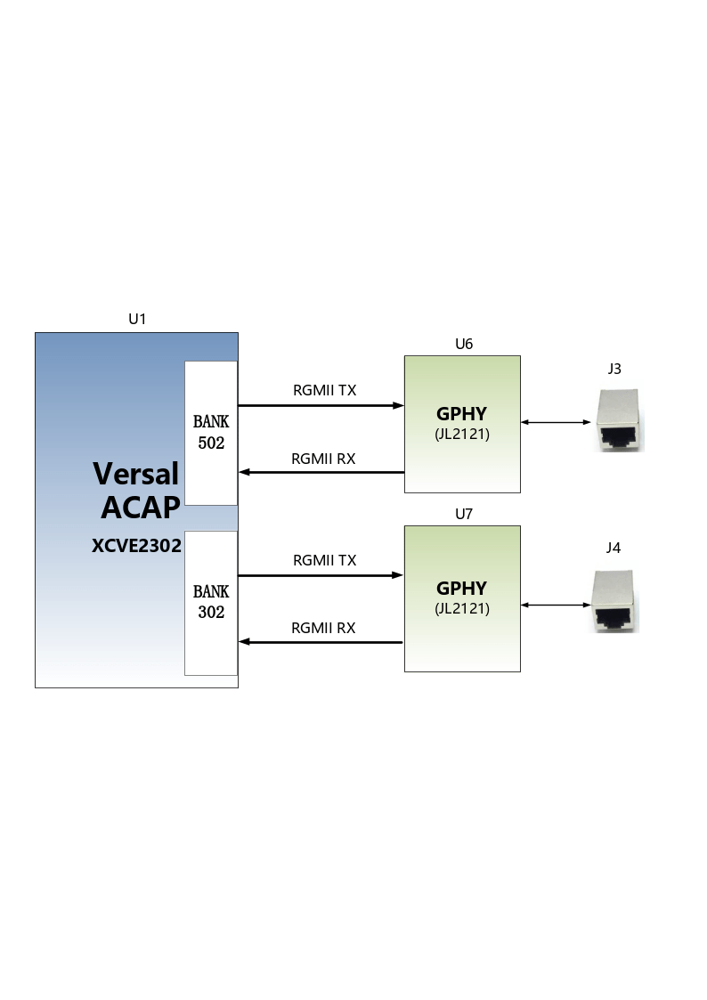

图3-2-1千兆以太网接口设计示意图

**千兆以太网引脚分配如下：**

+-----------------+----------------+----------+-----------------------+
| **信号名称**    | **引脚名**     | **       | **备注**              |
|                 |                | 引脚号** |                       |
+-----------------+----------------+----------+-----------------------+
| PHY1_TXCK       | LPD_MIO0       | T1       | 以太网1RGMII 发送时钟 |
+-----------------+----------------+----------+-----------------------+
| PHY1_TXD0       | LPD_MIO1       | U1       | 以太网1发送数据bit０  |
+-----------------+----------------+----------+-----------------------+
| PHY1_TXD1       | LPD_MIO2       | W1       | 以太网1发送数据bit1   |
+-----------------+----------------+----------+-----------------------+
| PHY1_TXD2       | LPD_MIO3       | Y1       | 以太网1发送数据bit2   |
+-----------------+----------------+----------+-----------------------+
| PHY1_TXD3       | LPD_MIO4       | Y2       | 以太网1发送数据bit3   |
+-----------------+----------------+----------+-----------------------+
| PHY1_TXCTL      | LPD_MIO5       | W2       | 以太网1发送使能信号   |
+-----------------+----------------+----------+-----------------------+
| PHY1_RXCK       | LPD_MIO6       | V2       | 以太网1RGMII接收时钟  |
+-----------------+----------------+----------+-----------------------+
| PHY1_RXD0       | LPD_MIO7       | U2       | 以太网1接收数据Bit0   |
+-----------------+----------------+----------+-----------------------+
| PHY1_RXD1       | LPD_MIO8       | T3       | 以太网1接收数据Bit1   |
+-----------------+----------------+----------+-----------------------+
| PHY1_RXD2       | LPD_MIO9       | U3       | 以太网1接收数据Bit2   |
+-----------------+----------------+----------+-----------------------+
| PHY1_RXD3       | LPD_MIO10      | V3       | 以太网1接收数据Bit3   |
+-----------------+----------------+----------+-----------------------+
| PHY1_RXCTL      | LPD_MIO11      | Y3       | 以                    |
|                 |                |          | 太网1接收数据有效信号 |
+-----------------+----------------+----------+-----------------------+
| PHY1_MDIO       | PS_MIO51       | AA10     | 以太网1MDIO管理数据   |
+-----------------+----------------+----------+-----------------------+
| PHY1_MDC        | PS_MIO50       | AB10     | 以太网1MDIO管理时钟   |
+-----------------+----------------+----------+-----------------------+
| PHY1_RESET      | LPD_MIO15      | T5       | 以太网1复位信号       |
+-----------------+----------------+----------+-----------------------+
| PHY2_TXCK       | B302_L9_N      | A13      | 以太网2 RGMII         |
|                 |                |          | 发送时钟              |
+-----------------+----------------+----------+-----------------------+
| PHY2_TXD0       | B302_L8_N      | A11      | 以太网2发送数据bit０  |
+-----------------+----------------+----------+-----------------------+
| PHY2_TXD1       | B302_L8_P      | B11      | 以太网2发送数据bit1   |
+-----------------+----------------+----------+-----------------------+
| PHY2_TXD2       | B302_L7_N      | A10      | 以太网2发送数据bit2   |
+-----------------+----------------+----------+-----------------------+
| PHY2_TXD3       | B302_L7_P      | B10      | 以太网2发送数据bit3   |
+-----------------+----------------+----------+-----------------------+
| PHY2_TXCTL      | B302_L9_P      | B12      | 以太网2发送使能信号   |
+-----------------+----------------+----------+-----------------------+
| PHY2_RXCK       | B302_L6_P      | D10      | 以太网2 RGMII接收时钟 |
+-----------------+----------------+----------+-----------------------+
| PHY2_RXD0       | B302_L5_N      | C12      | 以太网2接收数据Bit0   |
+-----------------+----------------+----------+-----------------------+
| PHY2_RXD1       | B302_L5_P      | D11      | 以太网2接收数据Bit1   |
+-----------------+----------------+----------+-----------------------+
| PHY2_RXD2       | B302_L10_N     | A14      | 以太网2接收数据Bit2   |
+-----------------+----------------+----------+-----------------------+
| PHY2_RXD3       | B302_L10_P     | B13      | 以太网2接收数据Bit3   |
+-----------------+----------------+----------+-----------------------+
| PHY2_RXCTL      | B302_L6_N      | C10      | 以                    |
|                 |                |          | 太网2接收数据有效信号 |
+-----------------+----------------+----------+-----------------------+
| PHY2_MDIO       | B302_L1_P      | C14      | 以太网2 MDIO管理数据  |
+-----------------+----------------+----------+-----------------------+
| PHY2_MDC        | B302_L1_N      | C13      | 以太网2 MDIO管理时钟  |
+-----------------+----------------+----------+-----------------------+
| PHY2_RESET      | B703_L12_P     | H23      | 以太网2复位信号       |
+-----------------+----------------+----------+-----------------------+

PCIe3.0 X4接口
--------------

VD100扩展板上提供一个工业级高速数据传输PCIe3.0
x4接口，PCIE卡的外形尺寸符合标准PCIe卡电气规范要求，可直接在普通PC的x4
PCIe插槽上使用。

PCIe接口的收发信号直接跟FPGA的GTY收发器相连接，四通道的TX信号和RX信号都是以差分信号方式连接到FPGA，单通道通信速率可高达8G
bit带宽。PCIe的参考时钟由PC的PCIe插槽提供给开发板，参考时钟频率为100Mhz。

开发板的PCIe接口的设计示意图如下图3-3-1所示,其中TX发送信号和参考时钟CLK信号用AC耦合模式连接。

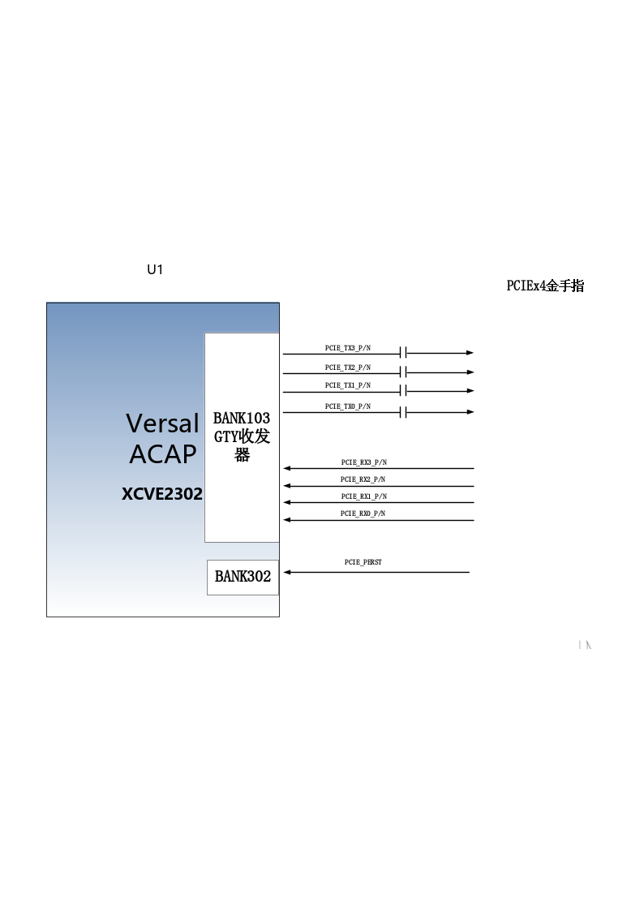

图3-3-1 PCIe x4设计示意图

   **PCIe x4接口FPGA引脚分配如下：**

+------------------+----------------+---------------------------------+
| **网络名称**     | **FPGA引脚**   | **备注**                        |
+------------------+----------------+---------------------------------+
| PCIE_RX0_P       | P2             | PCIE通道0数据接收 Positive      |
+------------------+----------------+---------------------------------+
| PCIE_RX0_N       | P1             | PCIE通道0数据接收Negative       |
+------------------+----------------+---------------------------------+
| PCIE_RX1_P       | M2             | PCIE通道1数据接收 Positive      |
+------------------+----------------+---------------------------------+
| PCIE_RX1_N       | M1             | PCIE通道1数据接收Negative       |
+------------------+----------------+---------------------------------+
| PCIE_RX2_P       | K2             | PCIE通道2数据接收 Positive      |
+------------------+----------------+---------------------------------+
| PCIE_RX2_N       | K1             | PCIE通道2数据接收Negative       |
+------------------+----------------+---------------------------------+
| PCIE_RX3_P       | H2             | PCIE通道3数据接收 Positive      |
+------------------+----------------+---------------------------------+
| PCIE_RX3_N       | H1             | PCIE通道3数据接收Negative       |
+------------------+----------------+---------------------------------+
| PCIE_TX0_P       | N5             | PCIE通道0数据发送 Positive      |
+------------------+----------------+---------------------------------+
| PCIE_TX0_N       | N4             | PCIE通道0数据发送Negative       |
+------------------+----------------+---------------------------------+
| PCIE_TX1_P       | L5             | PCIE通道1数据发送 Positive      |
+------------------+----------------+---------------------------------+
| PCIE_TX1_N       | L4             | PCIE通道1数据发送Negative       |
+------------------+----------------+---------------------------------+
| PCIE_TX2_P       | J5             | PCIE通道2数据发送 Positive      |
+------------------+----------------+---------------------------------+
| PCIE_TX2_N       | J4             | PCIE通道2数据发送Negative       |
+------------------+----------------+---------------------------------+
| PCIE_TX3_P       | G5             | PCIE通道3数据发送 Positive      |
+------------------+----------------+---------------------------------+
| PCIE_TX3_N       | G4             | PCIE通道3数据发送Negative       |
+------------------+----------------+---------------------------------+
| PCIE_CLK_P       | M7             | PCIE的参考时钟 Positive         |
+------------------+----------------+---------------------------------+
| PCIE_CLK_N       | M6             | PCIE的参考时钟Negative          |
+------------------+----------------+---------------------------------+
| PCIE_PERST       | B13            | PCIE复位信号                    |
+------------------+----------------+---------------------------------+

光纤接口
--------

VD100开发板上有2路SFP+光纤接口，用户可以购买SFP光模块(市场上1.25G，2.5G，10G光模块）插入到这2个光纤接口中进行光纤数据通信。2路光纤接口分别跟FPGA的BANK104的GTY收发器的2路RX/TX相连接，TX信号和RX信号都是以差分信号方式通过隔直电容连接FPGA和光模块，每路TX发送和RX接收数据速率高达10Gb/s。BANK104的GTY收发器的参考时钟由是156.25Mhz差分晶振提供。

FPGA和SFP光纤设计示意图如下图3-4-1所示:

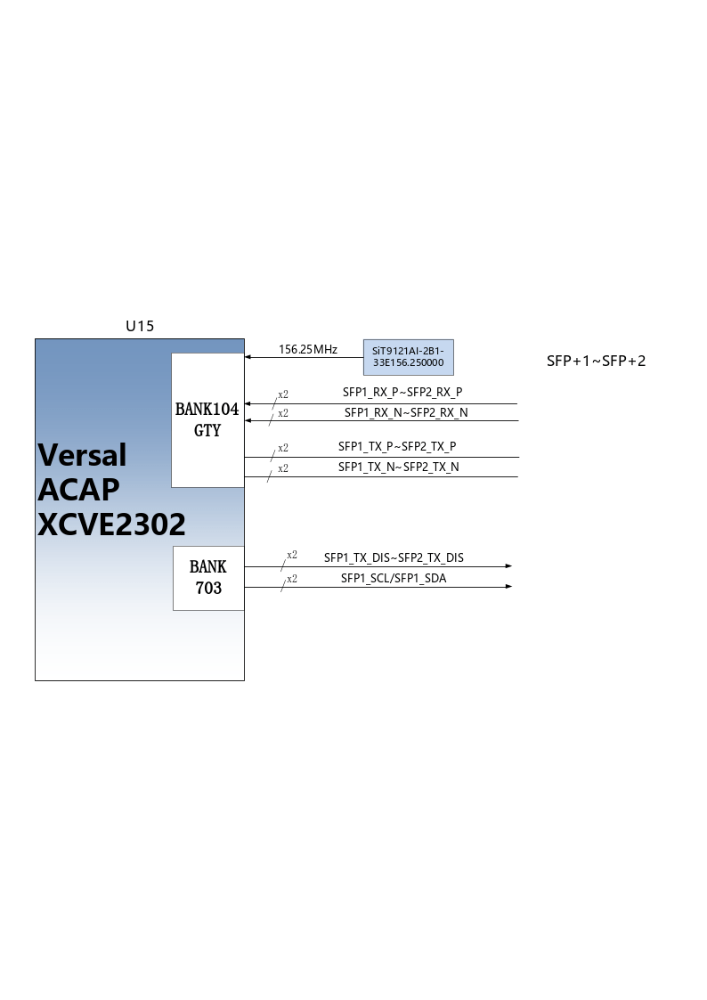

图3-4-1光纤设计示意图

   **第1路光纤接口FPGA引脚分配如下：**

+------------------+----------------+---------------------------------+
| **网络名称**     | **FPGA引脚**   | **备注**                        |
+------------------+----------------+---------------------------------+
| SFP1_TX_P        | E5             | SFP光模块数据发送 Positive      |
+------------------+----------------+---------------------------------+
| SFP1_TX_N        | E4             | SFP光模块数据发送Negative       |
+------------------+----------------+---------------------------------+
| SFP1_RX_P        | F2             | SFP光模块数据接收 Positive      |
+------------------+----------------+---------------------------------+
| SFP1_RX_N        | F1             | SFP光模块数据接收Negative       |
+------------------+----------------+---------------------------------+
| SFP1_TX_DIS      | D26            | SFP光模块光发射禁止，低有效     |
+------------------+----------------+---------------------------------+
| SFP1_SCL         | D21            | I2C时钟信号                     |
+------------------+----------------+---------------------------------+
| SFP1_SDA         | D20            | I2C数据信号                     |
+------------------+----------------+---------------------------------+

..

   **第2路光纤接口FPGA引脚分配如下：**

+------------------+----------------+---------------------------------+
| **网络名称**     | **FPGA引脚**   | **备注**                        |
+------------------+----------------+---------------------------------+
| SFP2_TX_P        | D8             | SFP光模块数据发送 Positive      |
+------------------+----------------+---------------------------------+
| SFP2_TX_N        | D7             | SFP光模块数据发送Negative       |
+------------------+----------------+---------------------------------+
| SFP2_RX_P        | D2             | SFP光模块数据接收 Positive      |
+------------------+----------------+---------------------------------+
| SFP2_RX_N        | D1             | SFP光模块数据接收Negative       |
+------------------+----------------+---------------------------------+
| SFP2_TX_DIS      | D25            | SFP光模块光发射禁止，低有效     |
+------------------+----------------+---------------------------------+
| SFP_CLK_N        | H6             | FPGA输入时钟Negative            |
+------------------+----------------+---------------------------------+
| SFP_CLK_P        | H7             | FPGA输入时钟Positive            |
+------------------+----------------+---------------------------------+

USB转串口
---------

VD100扩展板上配备了1个连接到PS端的Uart转USB接口。转换芯片采用了Silicon
Labs CP2102GM的USB-UAR芯片, USB接口采用MINI
USB接口，可以用一根USB线将它连接到上PC的USB口进行串口数据通信 。

USB Uart电路设计的示意图如图3-5-1所示\ |image2| 

图3-5-1 USB转串口示意图

**UART转串口的FPGA引脚分配：**

+---------------+---------------------+-------------+----------------+
| **信号名称**  | **FPGA引脚名**      | **F         | **备注**       |
|               |                     | PGA引脚号** |                |
+---------------+---------------------+-------------+----------------+
| PS_UART0_RX   | LPD_MIO16           | U5          | Uart数据输入   |
+---------------+---------------------+-------------+----------------+
| PS_UART0_TX   | LPD_MIO17           | V5          | Uart数据输出   |
+---------------+---------------------+-------------+----------------+

USB2.0接口
----------

VD100扩展板上有1个USB2.0接口，支持HOST工作模式。USB2.0通过ULPI接口连接外部的USB3320C芯片，实现高速USB2.0的数据通信。

USB接口为扁型USB接口(USB Type A)，方便用户同时连接不同的USB
Slave外设(比如USB鼠标，键盘或U盘）。USB2.0连接的示意图如3-6-1所示：

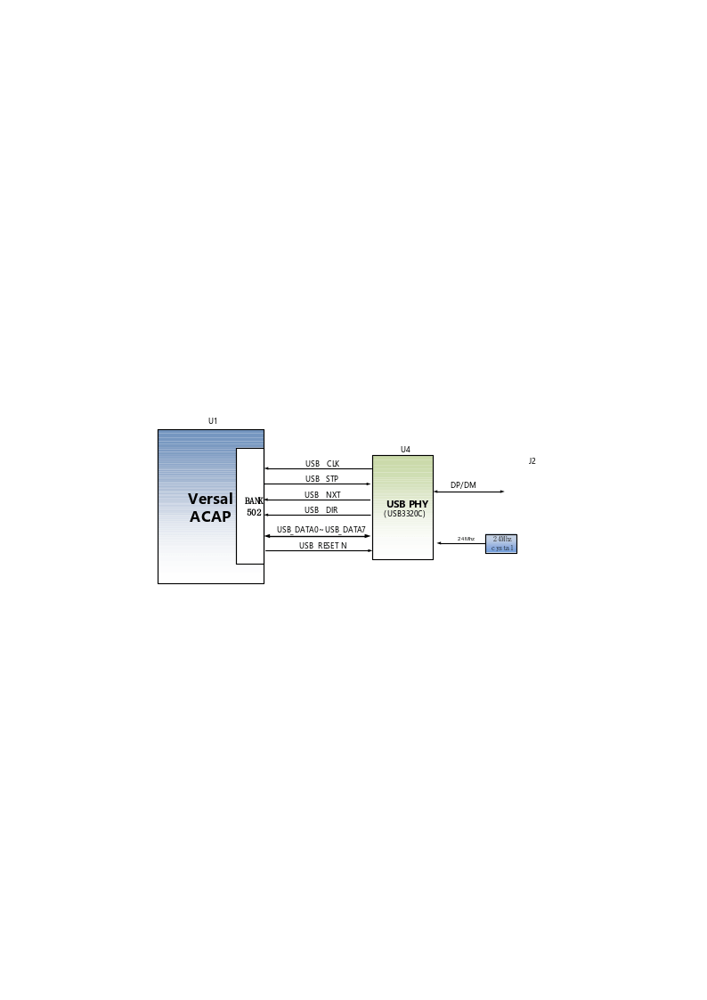

3-6-1 USB3.0接口示意图

**USB接口引脚分配：**

+---------------+--------------+------------+-------------------------+
| 信号名称      | 引脚名       | 引脚号     | 备注                    |
+---------------+--------------+------------+-------------------------+
| USB_DATA0     | PS_MIO14     | AC3        | USB2.0数据Bit0          |
+---------------+--------------+------------+-------------------------+
| USB_DATA1     | PS_MIO15     | AE3        | USB2.0数据Bit1          |
+---------------+--------------+------------+-------------------------+
| USB_DATA2     | PS_MIO16     | AF3        | USB2.0数据Bit2          |
+---------------+--------------+------------+-------------------------+
| USB_DATA3     | PS_MIO17     | AG3        | USB2.0数据Bit3          |
+---------------+--------------+------------+-------------------------+
| USB_DATA4     | PS_MIO19     | AH4        | USB2.0数据Bit4          |
+---------------+--------------+------------+-------------------------+
| USB_DATA5     | PS_MIO20     | AF4        | USB2.0数据Bit5          |
+---------------+--------------+------------+-------------------------+
| USB_DATA6     | PS_MIO21     | AE4        | USB2.0数据Bit6          |
+---------------+--------------+------------+-------------------------+
| USB_DATA7     | PS_MIO22     | AD4        | USB2.0数据Bit7          |
+---------------+--------------+------------+-------------------------+
| USB_STP       | PS_MIO24     | AA4        | USB2.0停止信号          |
+---------------+--------------+------------+-------------------------+
| USB_DIR       | PS_MIO23     | AC4        | USB2.0数据方向信号      |
+---------------+--------------+------------+-------------------------+
| USB_CLK       | PS_MIO18     | AH3        | USB2.0时钟信号          |
+---------------+--------------+------------+-------------------------+
| USB_NXT       | PS_MIO25     | Y4         | USB2.0下一数据信号      |
+---------------+--------------+------------+-------------------------+
| USB_RESET_N   | PS_MIO13     | AB3        | USB2.0复位信号          |
+---------------+--------------+------------+-------------------------+

LVDS显示屏接口
--------------

扩展板上包含了一个LVDS显示屏接口，可以用来接我们的7寸显示屏模块（AN7000）。LVDS接口是40PIN的FPC连接器，有4对LVDS的数据和1对时钟，以及其它的控制信号通过电平转换芯片连接到BANK703的差分IO管脚上，电平标准为1.5V。\ |image3|\ 

图3-7-1LVDS接口设计原理图

LVDS\ **接口引脚分配**

+--------------------+-------------+----------+-----------------------+
| **信号名称**       | **引脚名**  | **       | **备注**              |
|                    |             | 引脚号** |                       |
+--------------------+-------------+----------+-----------------------+
| LVDS_CLK-          | B703_L17_N  | A24      | LVDS屏输入时钟负      |
+--------------------+-------------+----------+-----------------------+
| LVDS_CLK+          | B703_L17_P  | A23      | LVDS屏输入时钟正      |
+--------------------+-------------+----------+-----------------------+
| LVDS_D0-           | B703_L13_N  | G23      | LV                    |
|                    |             |          | DS屏输入的数据DATA0负 |
+--------------------+-------------+----------+-----------------------+
| LVDS_D0+           | B703_L13_P  | F22      | LV                    |
|                    |             |          | DS屏输入的数据DATA0正 |
+--------------------+-------------+----------+-----------------------+
| LVDS_D1-           | B703_L22_N  | A21      | LV                    |
|                    |             |          | DS屏输入的数据DATA1负 |
+--------------------+-------------+----------+-----------------------+
| LVDS_D1+           | B703_L22_P  | A20      | LV                    |
|                    |             |          | DS屏输入的数据DATA1正 |
+--------------------+-------------+----------+-----------------------+
| LVDS_D2-           | B703_L23_N  | B22      | LV                    |
|                    |             |          | DS屏输入的数据DATA2负 |
+--------------------+-------------+----------+-----------------------+
| LVDS_D2+           | B703_L23_P  | C22      | LV                    |
|                    |             |          | DS屏输入的数据DATA2正 |
+--------------------+-------------+----------+-----------------------+
| LVDS_D3-           | B703_L10_N  | A26      | LV                    |
|                    |             |          | DS屏输入的数据DATA3负 |
+--------------------+-------------+----------+-----------------------+
| LVDS_D3+           | B703_L10_P  | A25      | LV                    |
|                    |             |          | DS屏输入的数据DATA3正 |
+--------------------+-------------+----------+-----------------------+
| FPGA_LCD_SDI       | B703_L11_N  | B27      | LCD屏串行             |
|                    |             |          | 接口地址和SPI数据输入 |
+--------------------+-------------+----------+-----------------------+
| FPGA_LCD_CSB       | B703_L11_P  | B26      | LCD屏串               |
|                    |             |          | 行接口芯片SPl片选信号 |
+--------------------+-------------+----------+-----------------------+
| FPGA_LCD_SCL       | B703_L3_N   | E28      | LCD屏串行接口SPI时钟  |
+--------------------+-------------+----------+-----------------------+
| FPGA_LCD_SDO       | B703_L9_N   | B25      | LCD                   |
|                    |             |          | 屏串行接口SPI数据输出 |
+--------------------+-------------+----------+-----------------------+
| FPGA_LCD_RESET     | B703_L3_P   | E27      | LCD屏复位信号         |
+--------------------+-------------+----------+-----------------------+
| FPGA_LCD_STBYB     | B703_L25_N  | F25      | LCD屏模式设置信号     |
+--------------------+-------------+----------+-----------------------+
| FPGA_BANKLCD_SDA   | B703_L12_N  | H24      | 背光I2C数据           |
+--------------------+-------------+----------+-----------------------+
| FPGA_BANKLCD_SCL   | B703_L14_P  | E22      | 背光I2C时钟           |
+--------------------+-------------+----------+-----------------------+
| FPGA_BANKLCD_INT   | B703_L9_P   | C25      | 背光故障中断信号      |
+--------------------+-------------+----------+-----------------------+
| FPGA_BANKLCD_EN    | B703_L25_P  | E24      | 背光使能信号          |
+--------------------+-------------+----------+-----------------------+
| FPGA_BANKLCD_PWM   | B703_L15_N  | C24      | 背光亮度调节信号      |
+--------------------+-------------+----------+-----------------------+
| FPGA_BANKLCD_SYNC  | B703_L15_P  | D24      | 背光同步升压输入      |
+--------------------+-------------+----------+-----------------------+
| LVDS_CLK_N         | B703_L24_N  | F24      | FPGA输入时钟负        |
+--------------------+-------------+----------+-----------------------+
| LVDS_CLK_P         | B703_L24_P  | F23      | FPGA输入时钟正        |
+--------------------+-------------+----------+-----------------------+

MIPI接口
--------

VD100扩展板上包含了2个MIPI 4 Lane摄像头接口，可以用来接我们的MIPI
OS05A10像头模块（AN5010）。MIPI接口是20PIN的FPC连接器，为4个LANE的数据和1对时钟，连接到BANK702的差分IO管脚上，电平标准为1.2V；其它的控制信号通过电平转换连接到BANK703的IO上，电平标准为1.5V。

|image4| 

图3-8-1 MIPI接口设计原理图

**MIPI接口引脚分配**

+---------------+--------------+------------+------------------------+
| **信号名称**  | **引脚名**   | **引脚号** | **备注**               |
+---------------+--------------+------------+------------------------+
| MIPI1_CLK_N   | B702_L12_N   | T24        | MIPI1输入时钟负        |
+---------------+--------------+------------+------------------------+
| MIPI1_CLK_P   | B702_L12_P   | U23        | MIPI1输入时钟正        |
+---------------+--------------+------------+------------------------+
| MIPI1_LAN0_N  | B702_L13_N   | R24        | MIPI1输入的数据LANE0负 |
+---------------+--------------+------------+------------------------+
| MIPI1_LAN0_P  | B702_L13_P   | T23        | MIPI1输入的数据LANE0正 |
+---------------+--------------+------------+------------------------+
| MIPI1_LAN1_N  | B702_L14_N   | P24        | MIPI1输入的数据LANE1负 |
+---------------+--------------+------------+------------------------+
| MIPI1_LAN1_P  | B702_L14_P   | R23        | MIPI1输入的数据LANE1正 |
+---------------+--------------+------------+------------------------+
| MIPI1_LAN2_N  | B702_L16_N   | K24        | MIPI1输入的数据LANE2负 |
+---------------+--------------+------------+------------------------+
| MIPI1_LAN2_P  | B702_L16_P   | L23        | MIPI1输入的数据LANE2正 |
+---------------+--------------+------------+------------------------+
| MIPI1_LAN3_N  | B702_L15_N   | M23        | MIPI1输入的数据LANE3负 |
+---------------+--------------+------------+------------------------+
| MIPI1_LAN3_P  | B702_L15_P   | M22        | MIPI1输入的数据LANE3正 |
+---------------+--------------+------------+------------------------+
| MIPI1_SDA     | B703_L2_N    | F28        | MIPI1摄像头的I2C数据   |
+---------------+--------------+------------+------------------------+
| MIPI1_SCL     | B703_L2_P    | G27        | MIPI1摄像头的I2C时钟   |
+---------------+--------------+------------+------------------------+
| MIPI1_GPIO    | B703_L7_N    | G26        | MIPI1摄像头的GPIO控制  |
+---------------+--------------+------------+------------------------+
| MIPI1_CLK     | B703_L7_P    | G25        | MIPI1摄像头的时钟输入  |
+---------------+--------------+------------+------------------------+
| MIPI2_CLK_N   | B702_L18_N   | U22        | MIPI2输入时钟负        |
+---------------+--------------+------------+------------------------+
| MIPI2_CLK_P   | B702_L18_P   | V21        | MIPI2输入时钟正        |
+---------------+--------------+------------+------------------------+
| MIPI2_LAN0_N  | B702_L19_N   | R22        | MIPI2输入的数据LANE0负 |
+---------------+--------------+------------+------------------------+
| MIPI2_LAN0_P  | B702_L19_P   | T21        | MIPI2输入的数据LANE0正 |
+---------------+--------------+------------+------------------------+
| MIPI2_LAN1_N  | B702_L20_N   | P22        | MIPI2输入的数据LANE1负 |
+---------------+--------------+------------+------------------------+
| MIPI2_LAN1_P  | B702_L20_P   | R21        | MIPI2输入的数据LANE1正 |
+---------------+--------------+------------+------------------------+
| MIPI2_LAN2_N  | B702_L21_N   | M21        | MIPI2输入的数据LANE2负 |
+---------------+--------------+------------+------------------------+
| MIPI2_LAN2_P  | B702_L21_P   | N21        | MIPI2输入的数据LANE2正 |
+---------------+--------------+------------+------------------------+
| MIPI2_LAN3_N  | B702_L22_N   | L22        | MIPI2输入的数据LANE3负 |
+---------------+--------------+------------+------------------------+
| MIPI2_LAN3_P  | B702_L22_P   | K21        | MIPI2输入的数据LANE3正 |
+---------------+--------------+------------+------------------------+
| MIPI2_SDA     | B703_L4_N    | C28        | MIPI2摄像头的I2C数据   |
+---------------+--------------+------------+------------------------+
| MIPI2_SCL     | B703_L4_P    | D27        | MIPI2摄像头的I2C时钟   |
+---------------+--------------+------------+------------------------+
| MIPI2_GPIO    | B703_L0_N    | H28        | MIPI2摄像头的GPIO控制  |
+---------------+--------------+------------+------------------------+
| MIPI2_CLK     | B703_L0_P    | J27        | MIPI2摄像头的时钟输入  |
+---------------+--------------+------------+------------------------+

SD卡
----

VD100扩展板包含了一个Micro型的SD卡接口，以提供用户访问SD卡存储器，用于存储XCVE2302芯片的BOOT程序，Linux操作系统内核,
文件系统以及其它的用户数据文件。

SDIO信号与XCVE2302的PS
BANK501的IO信号相连，因为501的VCCIO设置为1.8V，但SD卡的数据电平为3.3V,
我们这里通过TXS02612电平转换器来连接。XCVE2302
PS和SD卡连接器的原理图如图3-9-1所示。

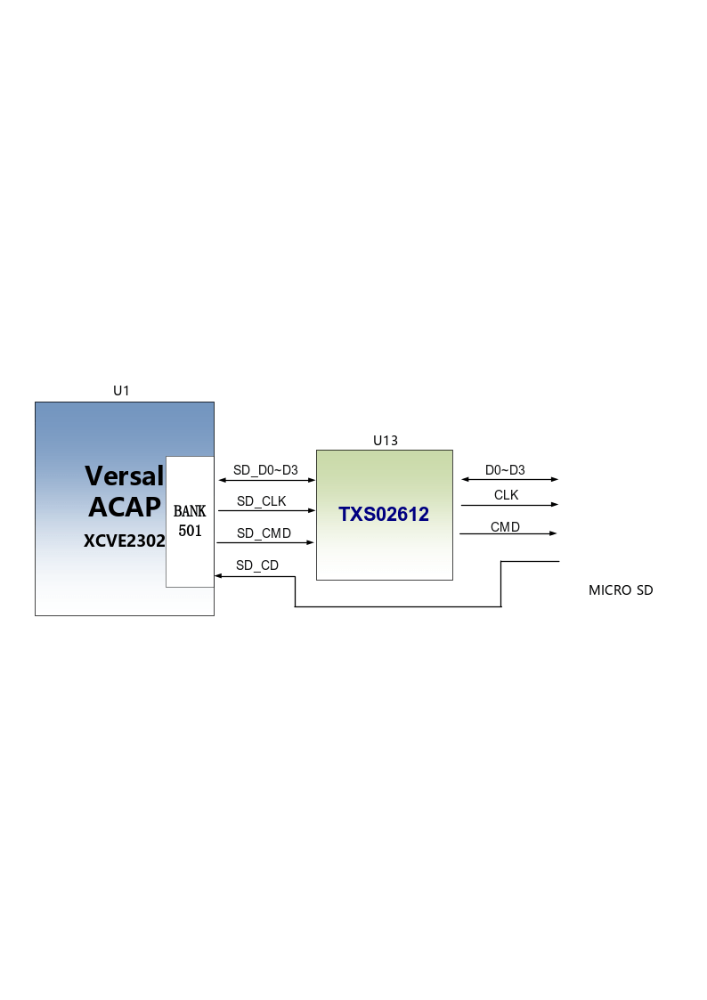

图3-9-1 SD卡连接示意图

**SD卡槽引脚分配**

+---------------+--------------+------------+-------------------------+
| **信号名称**  | **引脚名**   | **引脚号** | **备注**                |
+---------------+--------------+------------+-------------------------+
| SD_CLK        | PS_MIO26     | AA5        | SD时钟信号              |
+---------------+--------------+------------+-------------------------+
| SD_CD         | PS_MIO28     | AC5        | SD卡检测信号            |
+---------------+--------------+------------+-------------------------+
| SD_CMD        | PS_MIO29     | AD5        | SD命令信号              |
+---------------+--------------+------------+-------------------------+
| SD_D0         | PS_MIO30     | AE6        | SD数据Data0             |
+---------------+--------------+------------+-------------------------+
| SD_D1         | PS_MIO31     | AD6        | SD数据Data1             |
+---------------+--------------+------------+-------------------------+
| SD_D2         | PS_MIO32     | AB6        | SD数据Data2             |
+---------------+--------------+------------+-------------------------+
| SD_D3         | PS_MIO33     | AA6        | SD数据Data3             |
+---------------+--------------+------------+-------------------------+

EEPROM 24LC04和温度传感器
-------------------------

VD100开发板板载了一片EEPROM，型号为24LC04,容量为：4Kbit（2*256*8bit），通过IIC总线连接到PS端进行通信。另外板上还带有一个高精度、低功耗、数字温度传感器芯片，型号为ON
Semiconductor公司的LM75，LM75芯片的温度精度为0.5度。EEPROM和温度传感器通过I2C总线挂载到Versal
ACAP的Bank501 MIO上。图3-10-1为EEPROM和温度传感器的原理图

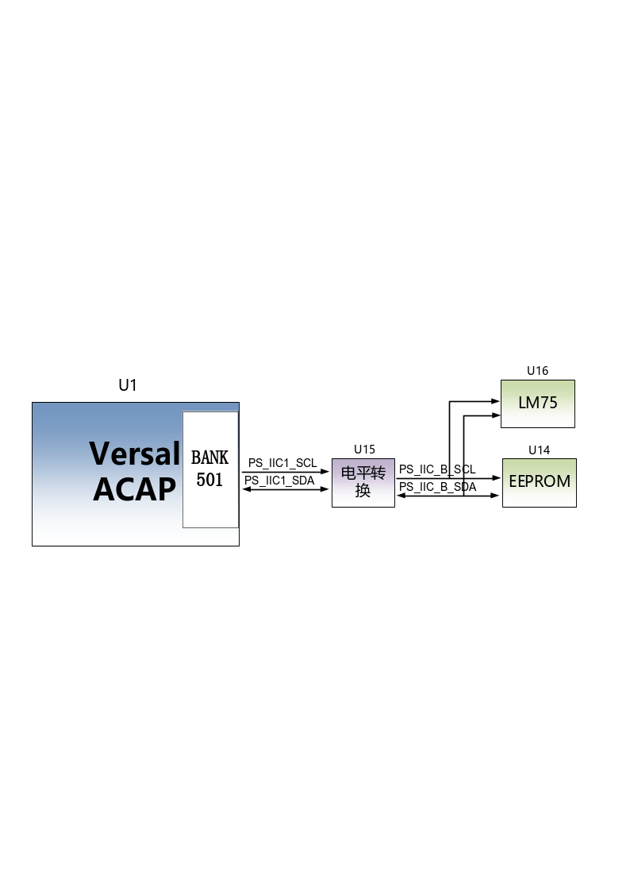

图3-10-1 EEPROM和传感器的原理图

**EEPROM通信引脚分配如下：**

+-----------------+----------------+----------------+----------------+
| 信号名称        | 引脚名         | 引脚号         | 备注           |
+-----------------+----------------+----------------+----------------+
| PS_IIC1_SCL     | PS_MIO34       | AB7            | I2C时钟信号    |
+-----------------+----------------+----------------+----------------+
| PS_IIC1_SDA     | PS_MIO35       | AC7            | I2C数据信号    |
+-----------------+----------------+----------------+----------------+

JTAG接口
--------

开发板预留了一个JTAG接口，用于下载FPGA程序或者固化程序到FLASH。为了带电插拔造成对FPGA芯片的损坏，我们在JTAG信号上添加了保护二极管来保证信号的电压在FPGA接受的范围，避免FPGA的损坏。

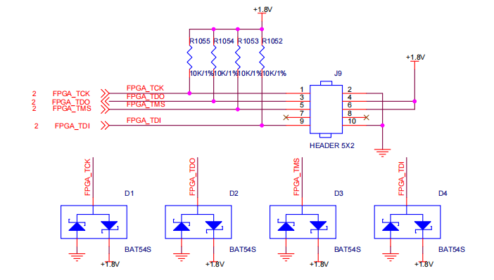

图3-8-1 JTAG接口原理图

JTAG线插拔的时候注意不要热插拔。

CANFD通信接口
-------------

VD100扩展板上有1路CAN/CANFD通信接口，连接在PS系统端BANK502的MIO接口上。CANFD收发芯片选用了智恩浦公司的TJA1051T/3/1J芯片为用户CAN通信服务。

图3-12-1为PS端CAN收发芯片的连接示意图

图3-12-1 PS端CAN收发芯片的连接示意图

**CAN通信引脚分配如下：**

+------------------+----------------+----------------+-----------------+
| **信号名称**     | **引脚名**     | **引脚号**     | **备注**        |
+------------------+----------------+----------------+-----------------+
| CANFD_TXD1       | LPD_MIO23      | Y7             | CAN1 发送端     |
+------------------+----------------+----------------+-----------------+
| CANFD_RXD1       | LPD_MIO22      | T6             | CAN1 接收端     |
+------------------+----------------+----------------+-----------------+

PMOD拓展口
----------

扩展板预留1个12PIN
2.54mm标准间距的PMOD的扩展口J55，用于连接外部模块或者设备，扩展口有3.3V电源2路，地2路，IO口8路。IO的电平标准为3.3V，\ **切勿跟5V设备的IO直接连接，以免烧坏FPGA。如果要接5V设备的IO，需要接电平转换芯片。**

扩展口(55)的电路如下图3-13-1所示

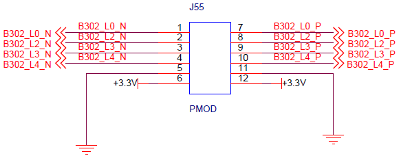

图3-13-1扩展口J55原理图

**J55扩展口FPGA的引脚分配**

+----------+-------------+------------+----------+------------+------------+
| **J55引  | **FPGA**    | **FPGA**   | **J55引  | **FPGA**   | **FPGA**   |
| 脚编号** | **引脚名**  | **引脚号** | 脚编号** | **引脚名** | **引脚名** |
+----------+-------------+------------+----------+------------+------------+
| 1        | B302_L0_N   | E14        | 7        | B          | F14        |
|          |             |            |          | 302_L0_P   |            |
+----------+-------------+------------+----------+------------+------------+
| 2        | B302_L2_N   | D14        | 8        | B          | E13        |
|          |             |            |          | 302_L2_P   |            |
+----------+-------------+------------+----------+------------+------------+
| 3        | B302_L3_N   | D12        | 9        | B          | E12        |
|          |             |            |          | 302_L3_P   |            |
+----------+-------------+------------+----------+------------+------------+
| J4       | B302_L4_N   | E11        | 10       | B          | F11        |
|          |             |            |          | 302_L4_P   |            |
+----------+-------------+------------+----------+------------+------------+
| 5        | GND         | -          | 11       | GND        | -          |
+----------+-------------+------------+----------+------------+------------+
| 6        | +3.3V       | -          | 12       | +3.3V      | -          |
+----------+-------------+------------+----------+------------+------------+

按键
----

扩展板上含有2个用户按键KEY1~KEY2，两个按键都连接到FPGA的普通的IO上，一个连接到PL端，另一个连接到PS端。按键低电平有效，当按键按下，FPGA的IO输入电压为低，当没有按键按下时，FPGA的IO输入电压为高。按键部分电路如下图3-10-1所示

.. image:: images/media/image27.png
   :width: 5.54097in
   :height: 3.44236in

图3-14-1按键硬件设计示意图

**按键FPGA引脚分配：**

+--------------+------------------+------------+----------------------+
| **信号名称** | **FPGA引脚名**   | **FP       | **备注**             |
|              |                  | GA引脚号** |                      |
+--------------+------------------+------------+----------------------+
| PS_LED1      | LPD_MIO25        | Y9         | 用户按键1            |
+--------------+------------------+------------+----------------------+
| PL_KEY1      | B703_L19_N       | F21        | 用户按键2            |
+--------------+------------------+------------+----------------------+

.. _led灯-1:

LED灯
-----

扩展板上有3个红色LED灯，其中1个是电源指示灯(PWR)，2个是用户LED灯（LED1~LED2）。当开发板供电后，电源指示灯会亮起。用户LED1~LED2连接到FPGA的普通IO，一个连接到PL端，另一个连接到PS端，当连接用户LED灯的IO电压配置为高电平时，用户LED灯点亮，当连接IO电压为配置为低电平时，用户LED会被熄灭。LED灯硬件连接的原理图如图3-11-1所示

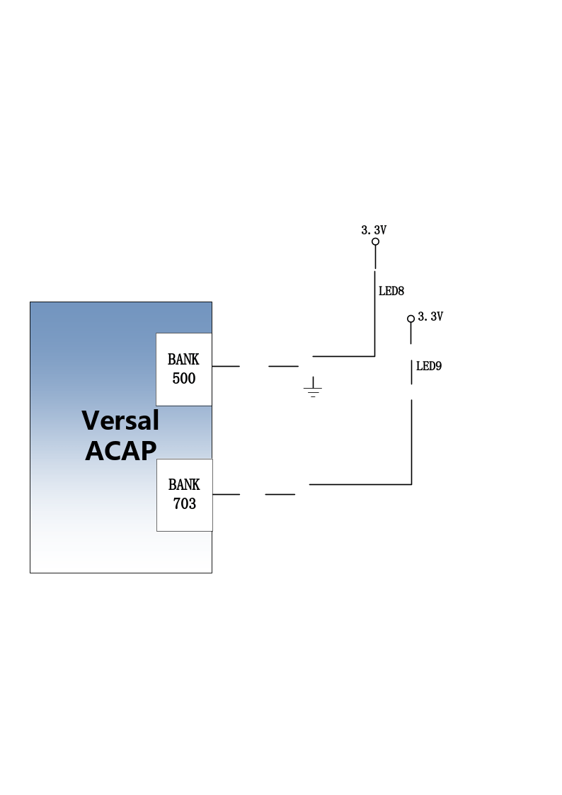

图3-15-1 LED灯硬件设计原理图

**LED FPGA引脚分配：**

+--------------+-------------------+---------------+-------------------+
| **信号名称** | **FPGA引脚名**    | **FPGA引脚号**| **备注**          |
+--------------+-------------------+---------------+-------------------+
| PS_LED1      | LPD_MIO25         | Y9            | 用户定义指示灯    |
+--------------+-------------------+---------------+-------------------+
| PL_LED1      | B703_L19_P        | E20           | 用户定义指示灯    |
+--------------+-------------------+---------------+-------------------+

供电电源
--------

开发板的电源输入电压为DC12V，请使用开发板自带的电源,不要用其他规格的电源，以免损坏开发板。扩展板上通过3路DC/DC电源芯片ETA1471FT2G转化成+5V，+3.3V，+1.8V三路电源，再通过LDO电源芯片SPX3819M5-1-5将+3.3V转化为+1.5V。另外扩展板上的+12V电源通过板间连接器给核心板供电，扩展上的电源设计如下图3-12-1所示

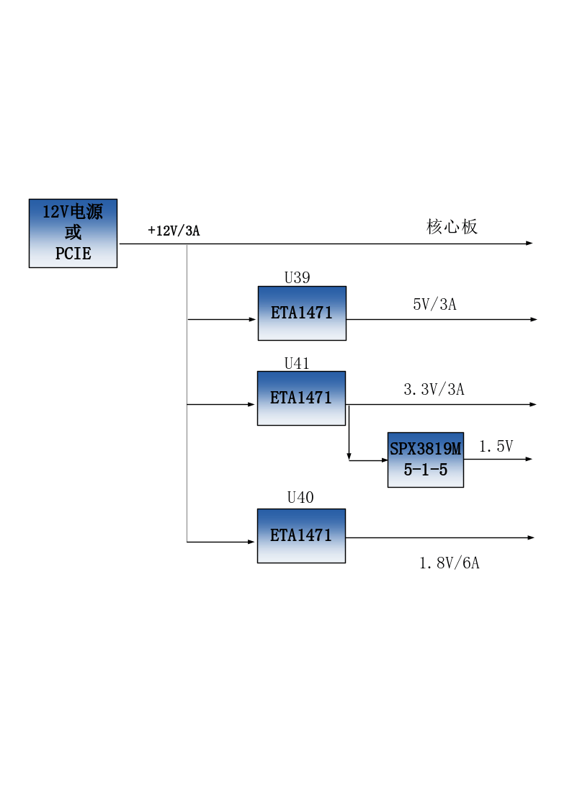

图3-16-1扩展板电源原理图

结构尺寸图
----------

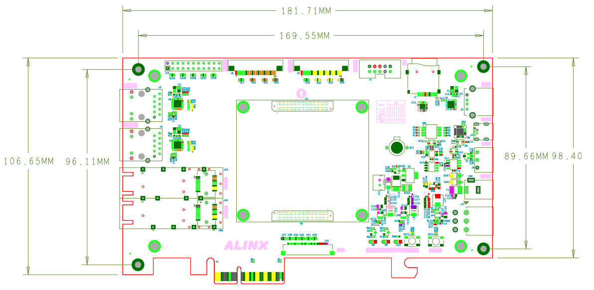

正面图（Top View）

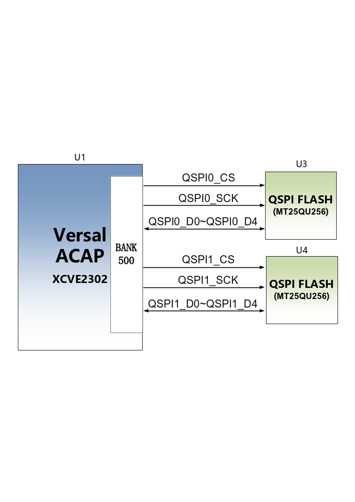
.. |image2| image:: images/media/image18.png
.. |image3| image:: images/media/image20.png
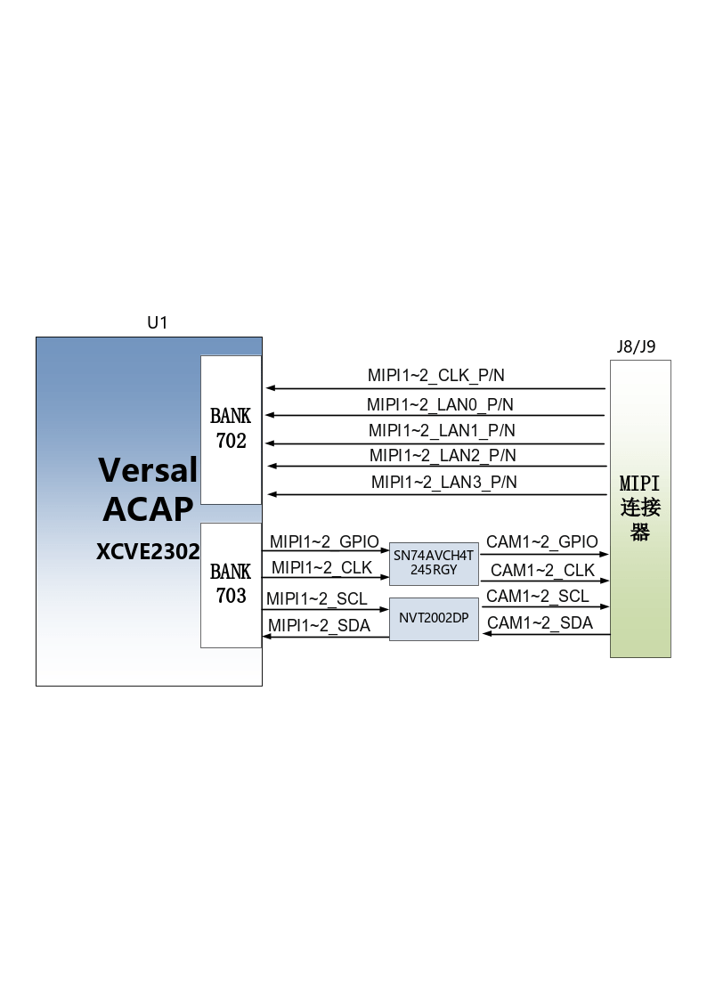
